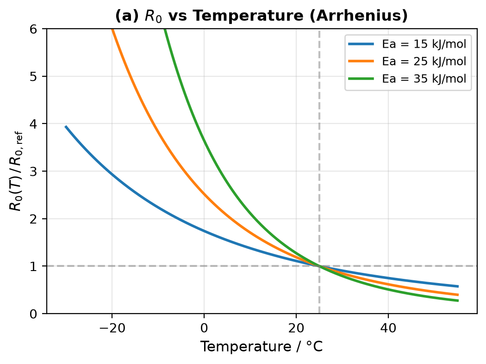
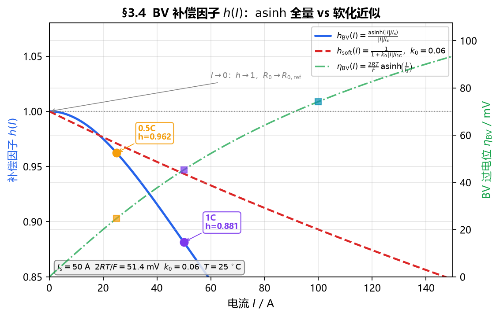
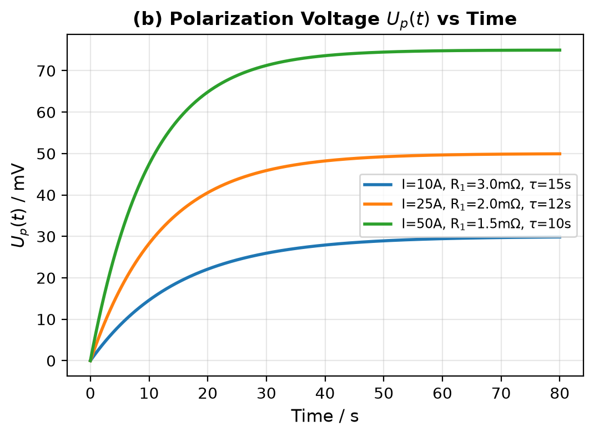
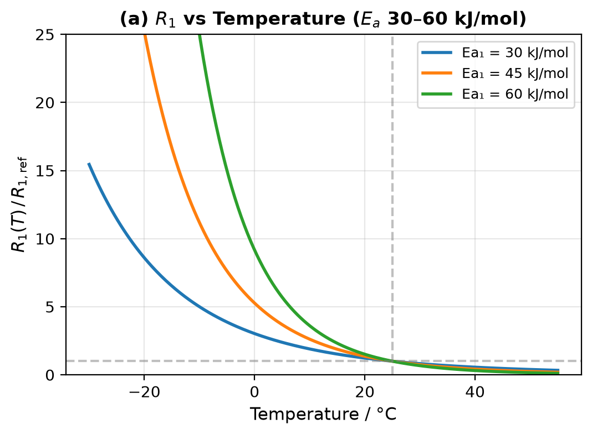
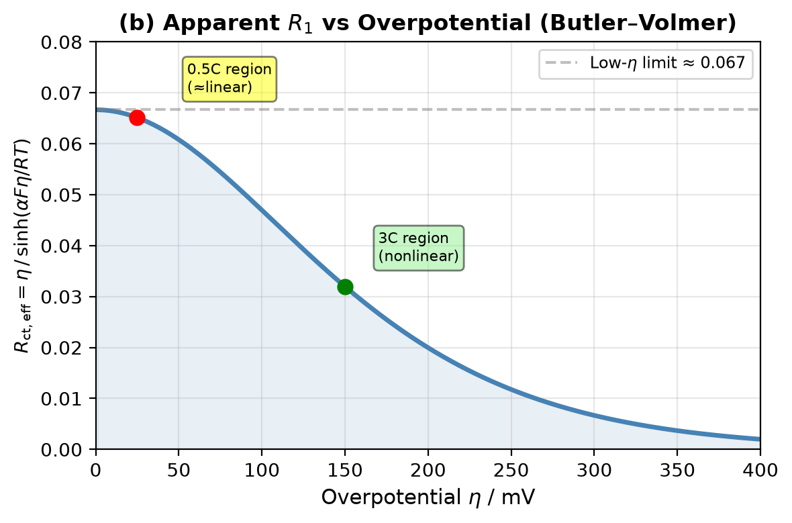

# 01-a NCM 电芯 ECM 参数 R0、R1、C1 特性
Powered by SpaceXAI Grok 4.6

> 对象：三元锂离子电芯（NCM/NMC，含 NCM111 / 523 / 622 / 811 等）  
> 模型：默认一阶 Thevenin（OCV + R0 + R1∥C1）；§7 补二阶，§8 补更高阶与 2RC 覆盖不了的工况  
> 用途：BMS 电压预测、SOC/SOP/SOH 估计、热功率计算、参数标定与在线辨识  
> 2RC 模板数值见 `Doc/01-b`；1RC 解码器对高阶真值的误差见 `Doc/02-a` §11、`Doc/02-b` §10

---

## 1. 模型与参数定义

一阶 RC（Thevenin）ECM 的电路结构为：

```
        I →
  ○── R0 ──┬── R1 ──┬──○  Ut
           │        │
          C1        │
           │        │
           └────────┘
           │
          Uocv(SOC, T)
           │
          GND
```

连续时间方程（放电电流 \(I>0\) 时压降为正）：

\[
\begin{aligned}
\dot{U}_{p} &= -\frac{U_{p}}{R_{1}C_{1}} + \frac{I}{C_{1}} \\
U_{t} &= U_{\mathrm{ocv}}(\mathrm{SOC},T) - I R_{0} - U_{p}
\end{aligned}
\]

时间常数：

\[
\tau_{1} = R_{1} C_{1}
\]

| 参数 | 名称 | 物理对应（集总） | 时间尺度 |
|------|------|------------------|----------|
| \(R_{0}\) | 欧姆内阻 | 电解液离子电阻、集流体/极耳/接触电阻、SEI 欧姆分量、电极电子电阻 | 瞬时（µs–ms），脉冲边沿立即显现 |
| \(R_{1}\) | 极化电阻 | 电荷转移电阻 \(R_{\mathrm{ct}}\)、SEI/CEI 膜电阻，以及部分被 1RC 吞并的浓差极化 | 秒级（典型 1–50 s） |
| \(C_{1}\) | 极化电容 | 双电层电容 \(C_{\mathrm{dl}}\) 的集总，并吸收部分扩散动力学 | 与 \(R_{1}\) 共同决定 \(\tau_{1}\) |

> **说明**：1RC 是工程折中。电化学上至少存在“电荷转移（快）+ 固/液相扩散（慢）”两个时间尺度。BMS 默认仍用 1RC；仿真或离线对照升到 2RC（\(R_{1}C_{1}\) 快极化 + \(R_{2}C_{2}\) 慢扩散）。下文未特别声明时按 1RC 叙述，2RC / 更高阶集中在 §7、§8。

二阶 Thevenin（两条并联 RC 串联在欧姆支路后）：

```
        I →
  ○── R0 ──┬── R1 ──┬── R2 ──┬──○  Ut
           │        │        │
           C1       C2       │
           │        │        │
           └────────┴────────┘
           │
          Uocv(SOC, T)
```

\[
\begin{aligned}
\dot{U}_{p1} &= -\frac{U_{p1}}{R_{1}C_{1}} + \frac{I}{C_{1}},\qquad
\dot{U}_{p2} &= -\frac{U_{p2}}{R_{2}C_{2}} + \frac{I}{C_{2}} \\
U_{t} &= U_{\mathrm{ocv}} - I R_{0} - U_{p1} - U_{p2}
\end{aligned}
\]

\[
\tau_{1}=R_{1}C_{1},\qquad \tau_{2}=R_{2}C_{2}
\]

| 参数 | 名称 | 物理对应（集总） | 时间尺度 |
|------|------|------------------|----------|
| \(R_{2}\) | 慢极化电阻 | 固相/液相浓差极化、孔隙内扩散的集总（Warburg 的有理近似） | 几十秒到数分钟（典型 20–200 s） |
| \(C_{2}\) | 慢极化电容 | 扩散“储锂”的集总，数量级通常大于 \(C_{1}\) | 与 \(R_{2}\) 共同决定 \(\tau_{2}\) |

EIS 对照（便于理解，不要求在线测）：

- \(R_{0}\) ≈ Nyquist 图高频实轴截距（\(R_{\Omega}\)）
- \(R_{1}\) ≈ 中频半圆直径（\(R_{\mathrm{ct}}+R_{\mathrm{SEI}}\) 的集总）
- \(C_{1}\) ≈ 半圆对应的等效电容
- 低频 45° 扩散尾巴（Warburg）在 1RC 中被部分并入 \(R_{1}C_{1}\)；2RC 里主要由 \(R_{2}C_{2}\) 承担
- 再低频的准电容爬升或第二个很大的弧，1RC/2RC 都吃不干净，见 §8

HPPC / 脉冲对照：

- \(R_{0} = \Delta U_{\mathrm{instant}} / I\)（电流阶跃后第一个采样点的电压跳变）
- 1RC：\(R_{1} \approx (\Delta U_{\mathrm{end}} - \Delta U_{\mathrm{instant}}) / I\)，\(\tau_{1}\) 由搁置单指数拟合，\(C_{1}=\tau_{1}/R_{1}\)
- 2RC：脉冲上升和回弹用双指数拆 \(\tau_{1},\tau_{2}\)；短窗（数秒）定快支路，长搁置（≥ \(3\tau_{2}\)）定慢支路。单指数会把慢尾巴折进一个偏大的 \(\tau_{1}\)

---

## 2. 参数的共性

NCM 电芯的 \(R_{0}\)、\(R_{1}\)、\(C_{1}\)（以及 2RC 的 \(R_{2}\)、\(C_{2}\)）**都不是常数**，工程上必须建成多维表或函数：

\[
P = f(\mathrm{SOC},\; T,\; I,\; \mathrm{方向},\; \mathrm{SOH},\; \mathrm{体系})
\]

其中 \(P \in \{R_{0}, R_{1}, C_{1}, R_{2}, C_{2}\}\)。各因子的相对强度大致为：

| 影响因素 | \(R_{0}\) | \(R_{1}\) | \(C_{1}\) | \(R_{2}\) | \(C_{2}\) |
|----------|-----------|-----------|-----------|-----------|-----------|
| 温度 \(T\) | 强（Arrhenius） | 很强（Arrhenius，\(E_{a}\) 更大） | 中等偏弱 | 强（扩散热激活） | 中等偏弱 |
| SOC | 中（两端升高） | 强（两端升高更明显） | 中（规律不如电阻稳定） | 中–强（两端浓差更重） | 中，易漂 |
| 电流倍率 / 方向 | 弱–中 | 中–强（Butler–Volmer 非线性） | 弱 | 弱–中（大电流浓差升） | 弱 |
| SOH / 老化 | 强、单调升 | 强、总体升 | 总体降 | 强、总体升 | 总体降 |
| 充/放不对称 | 弱–中 | 中 | 弱 | 弱–中 | 弱 |
| 辨识可观性 | 高、稳健 | 中 | 偏低，易与 \(R_{1}\) 耦合 | 需长搁置，易与 \(R_{1}\) 抢 | 最低 |

NCM 相对 LFP 的整体差别：

- NCM 的 OCV–SOC 有明显斜率，SOC 可观性更好；参数随 SOC 的变化比 LFP **更平滑**，但仍呈两端升高。
- NCM 电压滞后小于 LFP，但充/放参数仍建议分表。
- 高镍（622/811）表面重构、产气、CEI 生长更快，**老化后 \(R_{0}/R_{1}\) 上升速率高于中镍**。
- 石墨负极嵌锂平台（尤其 ~50–60% SOC 附近的 staging、以及低 SOC）会在 \(R_{1}\) 上留下局部凸起，这不是正极单独造成的。

---

## 3. R0（欧姆内阻）特性

### 3.1 物理图像

\(R_{0}\) 描述电流一施加就立刻出现的电压跳变，不经过电容充电。它主要由：

1. 电解液离子电导（隔膜孔隙内离子通路）
2. 正极/负极电子导电网络、集流体、极耳、焊点/软连接
3. SEI / CEI 的欧姆分量
4. 颗粒–颗粒、颗粒–集流体接触电阻

组成。因此 \(R_{0}\) 既是功率能力的第一限制项，也是老化最常用的电学健康因子。

瞬时压降：

\[
\Delta U_{0} = I \cdot R_{0}
\]

热功率中，欧姆热 \(I^{2}R_{0}\) 通常占产热的主要份额（尤其中高倍率、中高温）。

### 3.2 随 SOC

典型形态是 **浅 U 形 / 两端翘起**：

- **20%–80% SOC**：相对平坦，变化幅度通常只有两端的几分之一。
- **SOC < 15%–20%**：明显升高。低 SOC 时正极电子电导下降、电解液中锂离子活度变化、负极接近空嵌，接触与离子通路变差。
- **SOC > 90%**：轻度升高。高镍 NCM 在高电位发生 H2–H3 相变（约 4.15–4.25 V），晶格收缩导致接触变差，\(R_{0}\) 可出现局部台阶或上翘。
- 中段偶发小凸起：多来自负极石墨 staging，幅度一般小于两端。

工程含义：功率限制和低温 SOP 往往卡在低 SOC；满电附近的 \(R_{0}\) 抬升会放大充电末端压差，影响满充判断和充电截止策略。

### 3.3 随温度（最强因素之一）

\(R_{0}\) 服从近似 Arrhenius 关系（\({R}\) 是理想气体常数）：

\[
R_{0}(T) = R_{0,\mathrm{ref}} \cdot \exp\left[\frac{E_{a,0}}{R}\left(\frac{1}{T}-\frac{1}{T_{\mathrm{ref}}}\right)\right]
\]

<div align="center"></div>

| 项目 | 典型范围 |
|------|----------|
| 表观活化能 \(E_{a,0}\) | 约 15–35 kJ/mol（低于 \(R_{1}\)） |
| 25 °C → 0 °C | \(R_{0}\) 约增至 1.5–2.5 倍 |
| 25 °C → −20 °C | \(R_{0}\) 约增至 2–5 倍 |
| 25 °C → 45 °C | \(R_{0}\) 约降至 0.6–0.8 倍 |

物理原因：电解液电导率随温度指数变化；SEI 离子传导同样热激活。高温下 \(R_{0}\) 下降有利于功率，但加速副反应与老化。

> 低温下 \(R_{0}\) 升高是 NCM 功率衰减的重要原因，但通常 **不如 \(R_{1}\) 升得猛**。0 °C 以下往往是 \(R_{1}\) 主导总极化。

### 3.4 随电流与充放方向

- 真欧姆通路与电流无关（线性）。
- 实际辨识出的工程 \(R_{0}\) 会随倍率下降，尤其低温、0.5C / 1C / 2C 边沿对不齐时：
  - BMS 0.1 s 边沿已经把亚秒级电荷转移走完，\(R_{0}^{\mathrm{eng}}=R_\Omega+R_{\mathrm{ct}}^{\mathrm{fast}}(I)\)，快 \(R_{\mathrm{ct}}\) 服从 Butler–Volmer；
  - 大电流自热使电解液电导略升，实测再低一点；
  - 采样若晚于真正的“瞬时”，会把更多快极化算进 \(R_{0}\)，表现为随脉宽增大。
- 充/放不对称弱于 \(R_{1}\)。放电 \(R_{0}\) 在低 SOC 往往略高于充电；高镍体系高 SOC 充电侧可能更高。

**BV 补偿（参考）。** 对称 \(\alpha=1/2\)、一电子：

\[
I = 2 i_0 A\,\sinh\left(\frac{F\eta_{\mathrm{BV}}}{2RT}\right)
\qquad\Longleftrightarrow\qquad
\eta_{\mathrm{BV}}=\frac{2RT}{F}\,\mathrm{asinh}\left(\frac{I}{I_s}\right)
\]

\(I_s=2 i_0 A\)。常温 \(2RT/F\approx 51\,\mathrm{mV}\)。表观电荷转移电阻

\[
R_{\mathrm{ct}}(I)=\frac{\eta_{\mathrm{BV}}}{I}
=R_{\mathrm{ct}}^0\,\frac{\mathrm{asinh}(|I|/I_s)}{|I|/I_s},\qquad
R_{\mathrm{ct}}^0=\frac{RT}{i_0 A F}
\]

\(|I|\ll I_s\) 时 \(R_{\mathrm{ct}}\to R_{\mathrm{ct}}^0\)；大电流 \(\eta_{\mathrm{BV}}\) 只对数涨，表观电阻下降。因此 **0.5C / 1C / 2C 边沿不能并成一个 \(R_0\)**。

补偿二选一（对 \(I_{\mathrm{ref}}\) 归一，使参考点因子为 1）：

| 写法 | 公式 | 何时用 |
|------|------|--------|
| 电阻乘性 | \(R_0(I)=R_{0,\mathrm{ref}}\,f_I(I)\)，\(f_I=h(I)/h(I_{\mathrm{ref}})\) | 表上保留电流维 |
| 电压加性 | \(\Delta U_0=I R_\Omega+\eta_{\mathrm{BV}}(I)\) | \(R_0\) 钉真欧姆，边沿残差进 \(\eta_{\mathrm{BV}}\) |

\(h(I)\) 两档：

\[
\begin{aligned}
h_{\mathrm{BV}}(I)&=\frac{\mathrm{asinh}(|I|/I_s)}{|I|/I_s}\ (I\neq 0),\qquad h_{\mathrm{BV}}(0)=1 \\[4pt]
h_{\mathrm{soft}}(I)&=\frac{1}{1+k_0\,|I|/I_{1\mathrm{C}}}
\end{aligned}
\]

<div align="center"></div>

仓库模板用弱软化 \(k_0=0.06\)（`Doc/01-b` §3.4）：1C→2C 大约 −5%，只吸收自热和边沿里那一小截快 CT。全量 asinh 写在 \(R_1\)（§4.4，\(I_s=50\,\mathrm{A}\)）。**不要** \(R_0\) 与 \(R_1\) 各乘一份全量 \(h_{\mathrm{BV}}\)，边沿会补两次。

整段 NLS 也可以把 BV 写成设计列 \(\propto I\big/\sqrt{|I|/I_{1\mathrm{C}}+a}\)（\(a\sim 0.25\)），用来检验「常 \(R_0\) 吃不下多倍率边沿」。那一列会把 \(R_0\) 和修正项拆乱，**不能**当 \(R_0\) 估计，只证明缺的是 \(R_0(I)\) 不是第三只 RC。

标定：至少分 **充电表 / 放电表**。SOP 或边沿要准时，再按 0.5C / 1C / 2C 留电流维，或用上表其中一种补偿。不要只用常 \(R_0\) 去拟合多倍率边沿、把全部 BV 丢给 \(R_1\)——0.1 s 上看见的已经是工程 \(R_0\)。

### 3.5 随老化（SOH）

容量衰减的同时，\(R_{0}\) 几乎单调上升，是 NCM 最稳健的电学老化指标之一。

主要机理：

| 机理 | 对 \(R_{0}\) 的作用 |
|------|---------------------|
| SEI 持续生长、电解液消耗 | 离子通路变差，欧姆分量上升 |
| 过渡金属溶出、正极 CEI / 岩盐相表面重构 | 电子/离子传输变差（高镍更显著） |
| 颗粒开裂、导电剂脱落、集流体腐蚀 | 接触电阻上升 |
| 产气、极片膨胀导致接触松动 | 间歇性或阶跃式上升 |
| 析锂（低温/大倍率充电） | 表面膜加厚，\(R_{0}\) 加速上升 |

经验量级（仅供量级感，具体电芯差一个数量级都可能）：

- 容量保持率 80%（EOL）时，\(R_{0}\) 相对 BOL 常增加 **30%–100%**；
- 高温循环、高上限电压、快充会明显加快 \(R_{0}\) 增长；
- 日历老化同样抬升 \(R_{0}\)，但通常慢于循环老化。

Tran 等对锂离子电池综合 ECM 的结论与 NCM 实验一致：**SOH 下降时欧姆电阻与极化电阻上升，极化电容下降**。

### 3.6 体系与规格差异

| 体系 / 规格 | \(R_{0}\) 倾向 |
|-------------|---------------|
| NCM111 / 523 | 结构更稳，老化 \(R_{0}\) 增长较慢 |
| NCM622 / 811 | 能量密度高，表面更活泼，循环后 \(R_{0}\) 涨得更快 |
| 高镍 + 硅碳负极 | 体积膨胀大，接触电阻波动与增长更明显 |
| 薄电极 / 功率型 | \(R_{0}\) 低、倍率好 |
| 厚电极 / 能量型 | \(R_{0}\) 与极化都更大 |
| 容量归一 | 常用 \(R_{0}\cdot Q\)（mΩ·Ah）或面积比电阻比较不同规格 |

室温、中 SOC、BOL 的数量级（放电直流、秒级以内）：

| 电芯形态 | 典型容量 | \(R_{0}\) 量级 |
|----------|----------|----------------|
| 18650 | 2.5–3.5 Ah | 15–40 mΩ |
| 21700 | 4.5–5.5 Ah | 10–25 mΩ |
| 软包 50 Ah 级 | 40–60 Ah | 0.8–2.5 mΩ |
| 方壳 100 Ah+ | 100–280 Ah | 0.3–1.2 mΩ |

跨规格比较时优先看 **mΩ·Ah** 或 **mΩ·cm²**，不要直接比绝对毫欧。

### 3.7 对系统的影响

- 决定电流阶跃瞬间的电压裕度，直接卡充电上限 / 放电下限。
- SOP（可用功率）对 \(R_{0}\) 最敏感：\(P_{\mathrm{dis}} \approx U_{t}(U_{t,\min}-U_{\mathrm{ocv}}+IR_{\mathrm{dyn}})/R_{\mathrm{eq}}\)。
- 是在线内阻、SOH、一致性（模组压差）的首选特征。
- 采样频率过低会把 \(R_{1}\) 的快头混进 \(R_{0}\)，导致表不一致。

---

## 4. R1（极化电阻）特性

### 4.1 物理图像

\(R_{1}\) 描述电流施加后 **逐渐建立、撤流后逐渐消退** 的过电位幅度。1RC 里它是以下过程的集总：

1. 电荷转移（Butler–Volmer），对应 \(R_{\mathrm{ct}}\)
2. SEI / CEI 膜中的离子迁移
3. 部分浓差极化（本应由 Warburg / 第二 RC 承担）

因此 \(R_{1}\) 比 \(R_{0}\) 更“电化学”，对温度、SOC、电流、表面状态更敏感。

极化电压动态：

\[
U_{p}(t) = I R_{1}\left(1-e^{-t/\tau_{1}}\right) + U_{p}(0)\,e^{-t/\tau_{1}}
\]

<div align="center"></div>

脉冲足够长时，稳态极化压降 \(\approx IR_{1}\)。

### 4.2 随 SOC（强于 R0）

典型形态是 **更深的 U 形 / 浴缸形**：

- **30%–70% SOC**：相对最低且较平。
- **低 SOC（<20%，尤其 <10%）**：显著升高，常达到中段的 2–5 倍。交换电流密度随表面锂浓度下降，负极脱锂末期 / 正极嵌锂末期动力学变差。
- **高 SOC（>85%–90%）**：升高。正极高脱锂态、高镍相变、电解液氧化倾向增加；充电方向更明显。
- 石墨 staging 区间可能出现局部峰，高镍 H2–H3 相变附近也可能有局部结构。

工程含义：低 SOC 放电与高 SOC 快充的电压动态误差，多半来自 \(R_{1}\) 表不准，而不是 \(R_{0}\)。

### 4.3 随温度（三个参数里最陡）

电荷转移是典型热激活过程：

\[
R_{1}(T) = R_{1,\mathrm{ref}} \cdot \exp\left[\frac{E_{a,1}}{R}\left(\frac{1}{T}-\frac{1}{T_{\mathrm{ref}}}\right)\right]
\]

<div align="center"></div>

| 项目 | 典型范围 |
|------|----------|
| 表观活化能 \(E_{a,1}\) | 约 30–60 kJ/mol（高于 \(R_{0}\)） |
| 25 °C → 0 °C | \(R_{1}\) 约增至 2–4 倍 |
| 25 °C → −20 °C | \(R_{1}\) 约增至 5–20 倍 |
| 常温附近 | \(R_{1}\) 与 \(R_{0}\) 同量级，常为 \(0.5R_{0}\)–\(2R_{0}\) |
| 低温 | \(R_{1} \gg R_{0}\)，总极化由极化支路主导 |

这是 NCM 低温功率差、低温充电易析锂的电路侧表现：同样电流下过电位大，负极电位更容易被打到 0 V vs Li/Li⁺ 以下。

### 4.4 随电流（Butler–Volmer 非线性）

小电流下 \(R_{\mathrm{ct}}\) 近似线性；大过电位下表观电荷转移电阻下降。闭式与 §3.4 同一套 BV（对称 \(\alpha=1/2\)）：

\[
R_{\mathrm{ct}}(I)=R_{\mathrm{ct}}^0\,\frac{\mathrm{asinh}(|I|/I_s)}{|I|/I_s},\qquad
\eta_{\mathrm{BV}}=\frac{2RT}{F}\,\mathrm{asinh}\left(\frac{I}{I_s}\right)
\]

全量写在 \(R_1\)；工程 \(R_0\) 只吃边沿里已经走完的快头，见 §3.4，不要两边各乘一份。

<div align="center"></div>

因此：

- 用 0.5C HPPC 辨出的 \(R_{1}\) 直接用于 3C 脉冲，往往会 **偏大**，电压动态偏保守；
- 用大电流脉冲辨出的 \(R_{1}\) 用于小电流工况，可能 **偏小**；
- 自热会叠加，进一步降低大电流下的表观 \(R_{1}\)。

工程做法（按精度需求选一）：

1. \(R_{1}=f(\mathrm{SOC},T)\)，忽略电流（BMS 常用，简单）；
2. 增加电流维或充放分表；
3. 用简化 Butler–Volmer / 非线性电阻替换线性 \(R_{1}\)。

### 4.5 充 / 放不对称

NCM 的 \(R_{1}\) 充放不对称比 \(R_{0}\) 明显：

- 低 SOC：放电 \(R_{1}\) 通常更大（正极嵌锂 / 负极脱锂末期动力学差）；
- 高 SOC：充电 \(R_{1}\) 往往更大（正极高脱锂、界面氧化）；
- 高镍 + 高上限电压时，充电侧极化恶化更快。

OCV 滞后与 \(R_{1}\) 不对称会耦合。若 OCV 只用一条平均曲线，辨识会把滞后“吞”进 \(R_{1}\)，造成充放电参数对不上。正确做法是 **OCV 分充放（或带滞后态）+ \(R_{1}\) 分充放**。

### 4.6 随老化

总体随 SOH 下降而增大，机理与 \(R_{0}\) 重叠但更偏“活性界面”：

- 活性比表面积下降（颗粒隔离、岩盐相、导电网络断裂）→ \(i_{0}\) 下降 → \(R_{\mathrm{ct}}\) 上升；
- SEI/CEI 增厚 → 膜电阻上升；
- 析锂后表面膜剧烈增厚，\(R_{1}\) 可出现阶跃。

部分实验中 \(R_{1}\) 的相对增幅 **大于** \(R_{0}\)，尤其日历老化与低温循环。也有电芯在早期老化中 \(R_{1}\) 变化不明显、后期才加速，取决于限制环节在电解液还是界面。

### 4.7 与 R0 的相对关系

室温中 SOC、健康电芯：

\[
R_{1} \sim (0.5\sim 2)\,R_{0}
\]

温度降低或 SOC 走到两端时，\(R_{1}/R_{0}\) 迅速变大。因此：

- 只标一个总内阻 \(R_{\mathrm{dc}}\) 可以做粗 SOP，但无法描述回弹和动态电压；
- 低温 / 低 SOC / 老化后，漏掉 \(R_{1}\) 会造成电压预测偏乐观，过放、过充、析锂风险被低估。

---

## 5. C1（极化电容）特性

### 5.1 物理图像

\(C_{1}\) 不对应一只真实的电子学电容，而是把双电层充电、以及被 1RC 吸收的部分扩散过程，集总成一个能存储电荷的元件。其数量级是 **千法到十万法**，因为电极真实电化学面积极大：

\[
C_{1} \sim C_{\mathrm{dl}} \cdot A_{\mathrm{active}}
\]

\(C_{1}\) 本身不产生欧姆热，它决定极化建立/消退有多快。\(C_{1}\) 越大（\(R_{1}\) 一定时），\(\tau_{1}\) 越长，动态越“钝”。

### 5.2 随 SOC

规律不如 \(R_{0}/R_{1}\) 稳定，文献中常见几种形态：

- 中高 SOC 较大、低 SOC 减小（活性界面有效面积或表观 \(C_{\mathrm{dl}}\) 下降）；
- 随 SOC 缓慢上升；
- 两端略降、中段平坦。

辨识上 \(C_{1}\) 与 \(R_{1}\) 强耦合：同一组电压曲线，\(R_{1}\) 偏大、\(C_{1}\) 偏小（或相反）往往仍能拟合得不错，即存在 **\(R_{1}\uparrow \leftrightarrow C_{1}\downarrow\)** 的补偿。所以单独看 \(C_{1}\)–SOC 曲线抖动大，并不一定代表电芯真有那么多结构。更稳健的做法是：

- 先拟合 \(\tau_{1}\) 和 \(R_{1}\)，再算 \(C_{1}=\tau_{1}/R_{1}\)；
- 或对 \(C_{1}(\mathrm{SOC})\) 做平滑 / 单调性约束。

### 5.3 随温度

- 双电层电容随温度轻度增加；
- 同时 \(R_{1}\) 随温度急剧下降。

合在一起：

\[
\tau_{1}(T)=R_{1}(T)C_{1}(T)
\]

通常 **温度升高 → \(\tau_{1}\) 变短**（极化建立和回弹更快）。低温下不仅极化幅度大（\(R_{1}\) 大），而且建立/消退更慢，短脉冲还来不及走到稳态，辨识 \(C_{1}\) 更容易漂。

### 5.4 随老化

多数 NCM / 三元数据给出同一方向：

> **SOH 下降 → 极化电容 \(C_{1}\) 下降。**

对应活性表面积损失、孔隙堵塞、部分颗粒失联。\(C_{1}\) 下降 + \(R_{1}\) 上升，使 \(\tau_{1}\) 的变化方向不确定：

- 若 \(R_{1}\) 涨得更多，\(\tau_{1}\) 变长（回弹变慢，常见）；
- 若活性面积损失主导，\(\tau_{1}\) 也可能缩短。

因此 **不要单独用 \(C_{1}\) 或 \(\tau_{1}\) 做 SOH**；\(R_{0}\) 或 \(R_{0}+R_{1}\) 更可靠。\(C_{1}\) 适合作为辅助特征或约束项。

### 5.5 数量级

| 电芯 | \(C_{1}\) 量级 | \(\tau_{1}\) 量级（1RC） |
|------|----------------|--------------------------|
| 18650 / 21700 | \(10^{3}\)–\(10^{4}\) F | 2–30 s |
| 软包 / 方壳 50–100 Ah | \(10^{4}\)–\(10^{5}\) F | 5–50 s |
| 若拆成 2RC | 快支路 0.2–5 s；慢支路 20–200 s | |

看到“几千法拉”是正常的，不是单位错误。

### 5.6 辨识注意点

- \(C_{1}\) 对激励频谱敏感：脉冲太短，\(C_{1}\) 偏小；搁置太短，慢过程没结束，\(C_{1}\) 偏大。
- 电流传感器偏置、SOC 漂移会首先污染 \(C_{1}\)。
- 在线 RLS / EKF 中应对 \(C_{1}\) 做上下界（正、有限）和慢变化约束，否则容易飞。
- 工程上有时直接辨识 \((R_{0}, R_{1}, \tau_{1})\)，比直接辨识 \(C_{1}\) 更稳。

---

## 6. 时间常数 τ1 与动态表现

\[
\tau_{1}=R_{1}C_{1}
\]

| 工况 | \(\tau_{1}\) 倾向 | 端电压表现 |
|------|-------------------|------------|
| 常温、中 SOC、BOL | 数秒到十几秒 | 阶跃后先直跳（\(R_{0}\)）再指数弯（\(R_{1}C_{1}\)） |
| 低温 | 明显变长 | 回弹慢，短行程工况走不到稳态极化 |
| 低 / 高 SOC | 变长（\(R_{1}\) 主导） | 末端电压“拖尾” |
| 老化 | 多数变长 | 同一工况动态误差变大，需要更新参数 |
| 大电流 | 表观 \(\tau_{1}\) 可能变短 | 非线性 + 自热 |

1RC 的固有缺陷：用一个 \(\tau_{1}\) 同时拟合 1 s 内的电荷转移和 100 s 级扩散，必然顾此失彼。

- 关心 10 s 功率、HPPC 10 s 电阻：1RC 通常够用。
- 关心长时间恒流末端、休息 10 min 回弹、低频 EIS：应上 2RC 或加 Warburg / 滞后。

---

## 7. 二阶 RC（R2、C2）特性

2RC 把 1RC 里被吞掉的慢过程单独拉出来。快支路 \(R_{1}C_{1}\) 更接近电荷转移 / 膜过程，慢支路 \(R_{2}C_{2}\) 更接近扩散。两条支路在电压上是**相加**的，时间上是**分开**的：边沿仍几乎只有 \(R_{0}\)，数秒内看见 \(U_{p1}\)，几十秒到数分钟才看见 \(U_{p2}\)。

### 7.1 物理图像

锂离子在电解液孔隙和活性颗粒内部的扩散，频域上接近 Warburg（\(\propto 1/\sqrt{j\omega}\)），时域上是一串连续时间常数。2RC 用一只慢 RC 做最粗的有理近似：保住「还有一条明显比 \(\tau_{1}\) 慢的指数」，不追求和 EIS 低频尾巴逐点重合。

因此：

- \(R_{2}\) 是慢极化的**幅度**（稳态浓差过电位 \(\approx I R_{2}\)）
- \(\tau_{2}\) 是慢过程建立 / 消退有多慢
- \(C_{2}=\tau_{2}/R_{2}\) 仍然是集总，不是一只真实电容器；100 Ah 级常见 \(10^{5}\) F 量级

和 \(R_{1}\) 的分工：短脉冲、10 s SOP、边沿内阻看 \(R_{0}+R_{1}\)；停车数分钟后的电压、长时恒流末端、低温回弹拖尾看 \(R_{2}\)。

### 7.2 时间尺度要分开

两条 \(\tau\) 必须差开大约半个数量级以上，否则辨识上退回「一只等效 RC」。NCM 大电芯上常见：

| 支路 | \(\tau\) 典型 | 主要看见它的波形 |
|------|----------------|------------------|
| 快 \(R_{1}C_{1}\) | 0.5–10 s（1RC 里常被拉到十几秒） | 脉冲上升前几秒、撤流后的快回弹 |
| 慢 \(R_{2}C_{2}\) | 20–200 s（模板取约 90 s，见 `Doc/01-b`） | 撤流 1 min 之后的尾巴、数分钟恒流末端 |

\(\tau_{2}/\tau_{1}\lesssim 3\)：双指数拟合不稳，\(R_{1}\leftrightarrow R_{2}\) 对冲。  
\(\tau_{2}\gtrsim 10^{3}\,\mathrm{s}\)：默认数分钟工况几乎看不见，只有小时级搁置才露馅，和「OCV 没静置够」也分不清。

### 7.3 随 SOC

\(R_{2}\) 同样两端升高，往往比 \(R_{0}\) 深、比 \(R_{1}\) 略浅或相当：

- 中段（30%–70%）相对最低：固/液相浓度梯度好建立、也好消退
- 低 SOC：负极近空、正极近满，扩散系数下降，慢极化明显变大；长时放电末端电压「掉得比 1RC 快」多半在这里
- 高 SOC：高镍正极扩散变差、石墨 staging 附近也可能有局部结构；充电末端更明显

\(C_{2}\)–SOC 和 \(C_{1}\) 一样容易被辨识噪声弄脏。先盯 \(\tau_{2}\) 是否光滑，再算 \(C_{2}=\tau_{2}/R_{2}\)。

### 7.4 随温度

固相扩散和电解液浓差都是热激活，\(R_{2}\) 的表观 \(E_{a}\) 通常介于 \(R_{0}\) 与 \(R_{1}\) 之间，或接近 \(R_{1}\)（约 25–45 kJ/mol）。低温下：

- \(R_{2}\) 升、\(\tau_{2}\) 明显变长（常到数分钟）
- 短脉冲还走不到慢稳态，1RC 会把未走完的慢过程误判成更大的 \(\tau_{1}\) 或偏小的 \(R_{1}\)
- 低温充电的「过电位迟迟不消」里，慢支路占比上升

\(C_{2}\) 随温度轻度增加；\(\tau_{2}(T)\) 的主因仍是 \(R_{2}(T)\)。

### 7.5 随电流与充放

扩散支路的电流非线性弱于电荷转移：大电流下浓差会升，但 Butler–Volmer 那种「表观电阻明显下降」主要在 \(R_{1}\)。工程上 \(R_{2}(s,T)\) 往往先不加电流维；要加也是弱的正修正（大电流略升），不要照抄 \(R_{1}\) 的 asinh。

充放不对称存在，但通常弱于 \(R_{1}\)。低 SOC 放电、高 SOC 充电的慢尾巴更长。若 OCV 滞后没单独建模，慢回弹会被吞进 \(R_{2}\)，表现为充放 \(R_{2}\) 对不上。

### 7.6 随老化

与 \(R_{1}\) 同向：SOH 下降 → \(R_{2}\) 升、\(C_{2}\) 降。孔隙堵塞、颗粒裂纹、活性面积损失都拉长扩散路径。部分高镍快充电芯上，慢支路比欧姆项更早恶化。

不要单独用 \(R_{2}\) 或 \(\tau_{2}\) 当 SOH：可观性差，激励一变数就跳。内阻 SOH 仍以 \(R_{0}\) 或短时 \(R_{\mathrm{dyn}}\) 为主，\(R_{2}\) 作辅助。

### 7.7 对 1RC 表的含义

用 1RC 去拟合其实是 2RC 的电芯时：

- \(R_{0}\) 仍大致对（边沿可观）
- \(R_{1}\) 会偏大，\(\tau_{1}\) 会落到 \(\tau_{1}^{\mathrm{true}}\) 与 \(\tau_{2}\) 之间，随激励频谱变
- 短窗（10 s）电压往往仍可用；长搁置、长恒流出现系统性慢残差

这不是辨识失败，是模型阶次不够。定量误差见 `Doc/02-a` §11、`Doc/02-b` §10。本仓库 BMS 默认继续 1RC；2RC 优先放在仿真生成器，用来制造这种可解释的残差。

---

## 8. 更高阶与非集总

2RC 之后每加一只 RC，多一对 \((R_{i},C_{i})\) 和一条 \(\tau_{i}\)，电压上限略升，可观性迅速变差。NCM 上常见的「再往上」只有这几类，BMS 默认都不要上。

| 结构 | 多出来的是什么 | 时间 / 频率 | 何时才值得想 |
|------|----------------|-------------|--------------|
| 3RC | 再一条更慢的扩散或热–电耦合尾巴 | \(\tau_{3}\) 常 5–30 min | 休息 10 min 后 2RC 仍有数 mV 同号残差 |
| PNGV / 串联电容 | 脉冲期内 OCV 随 SOC 的准静态下滑 | 与安时同一尺度 | 长脉冲没扣 \(\Delta U_{\mathrm{ocv}}\) 时的替代写法 |
| Warburg / 有限空间扩散 | \(1/\sqrt{j\omega}\) 连续谱，不是单指数 | 低频 EIS | 要对齐 EIS 尾巴，而不是只拟合时域几分钟 |
| CPE / 分数阶 | 压扁的半圆、非整数阶微分 | 中低频 | 离线阻抗拟合；车上离散贵、难滤波 |
| 滞后态 | 充放 OCV 分叉、路径依赖 | 行程级 | LFP 更重；NCM 先分充放表通常够 |
| P2D / SPMe | 浓度场，不是集总 RC | 多尺度 | 仿真对照（如 PyBaMM），不是 BMS 电路 |

经验量级（100 Ah、1C、常温中 SOC，只作**参考点**数量级）：

- 1RC → 2RC：长回弹 / 长恒流末端常能再吃掉 **数 mV 到十几 mV**
- 2RC → 3RC：再吃 **2–8 mV**，且必须有 ≥10 min 搁置才分得开
- 3RC → Warburg / 分数阶：时域工况上往往 **< 3 mV**，换来不可观的一串极点

参考点上 2RC 通常够，和 `Doc/02-b` §10.4 一致。**离开参考点**（低温、两端 SOC、\(\gtrsim 2\mathrm{C}\) 连续、厚电极、\(\ge 10\,\mathrm{min}\) 搁置、老化 / 硅碳），未建模物理可以到十几 mV 乃至上百 mV；其中一类加 RC 也吃不掉。下面按机理写：2RC 近似了什么、丢掉了什么、哪类工况会显著露馅。

「显著」在本文：2RC 已按自己的窗（约 \(3\tau_{2}\)，模板数分钟）辨好之后，仍有 \(\gtrsim 8\)–\(10\,\mathrm{mV}\) 的**同号结构化**残差，或截止电压 / 持续 SOP / 休息点 SOC 被系统性拉偏。短窗 RMSE 好看不算覆盖住。

### 8.1 2RC 的有理近似边界

锂离子输运至少有两档**分布**时间，不是两只集总电容：

\[
\tau_{\mathrm{e}}\sim\frac{L^{2}}{D_{\mathrm{e}}^{\mathrm{eff}}},\qquad
\tau_{\mathrm{s}}\sim\frac{R_{\mathrm{p}}^{2}}{D_{\mathrm{s}}}
\]

| 过程 | 尺度怎么来 | 100 Ah 级常见 | 2RC 里落在哪 |
|------|------------|---------------|--------------|
| 孔隙液相扩散 | 极片厚度 \(L\sim 60\)–\(120\,\mu\mathrm{m}\)，\(D_{\mathrm{e}}^{\mathrm{eff}}\sim 10^{-10}\,\mathrm{m}^{2}/\mathrm{s}\) | \(\tau_{\mathrm{e}}\sim 40\)–\(150\,\mathrm{s}\) | **主要就是 \(R_{2}C_{2}\)** |
| 颗粒固相扩散 | 半径 \(R_{\mathrm{p}}\sim 5\)–\(12\,\mu\mathrm{m}\)，常温 \(D_{\mathrm{s}}\sim 10^{-15}\)–\(10^{-14}\,\mathrm{m}^{2}/\mathrm{s}\) | \(\tau_{\mathrm{s}}\sim 10^{3}\)–\(10^{5}\,\mathrm{s}\)（十几分钟到一天） | 只投影到谱的**前端**；后段 2RC 看不见 |
| 电荷转移 / 膜 | \(R_{\mathrm{ct}}C_{\mathrm{dl}}\) | 0.5–10 s | \(R_{1}C_{1}\) |

2RC 用一只慢指数保住「还有比 \(\tau_{1}\) 慢的过程」。数分钟窗里，液相浓差 + 固相扩散的前半段都能被 \(R_{2}C_{2}\) 投影掉。它故意丢掉的是：

1. 扩散核的**连续谱**（不是单极点；频域 \(1/\sqrt{j\omega}\)，时域中间段幂律）
2. 第二条更慢的固相时间（正、负极颗粒各一条，且粒度有分布）
3. 沿电极厚度的浓度场（集总假设「整片电极一个过电位」）
4. 与电流 / 浓度强非线性的部分（表面空/满、电解液局部抽干、**表面 OCP 非线性**见 §8.6）
5. 根本不是极化的：OCV 滞后、相变、析锂、热弛豫

半对数回弹：2RC 残差在 \(3\tau_{2}\) 内应接近噪声。若 5–10 min 后仍同号、且弯成**下凸**（先快后慢，不像第三条直线），就是连续谱或非集总，不是「再拟合一个 \(\tau_{3}\)」那么简单。

### 8.2 连续谱：Warburg / 有限空间扩散

半无限扩散阻抗 \(\propto 1/\sqrt{j\omega}\)（Nyquist 45°）。长恒流过电位中间段 \(\propto\sqrt{t}\)，撤流后中间段 \(\propto t^{-1/2}\)，颗粒半径把扩散域封成有限空间之后才拐成指数。单只 \(R_{2}C_{2}\) 从 \(t=0\) 就是指数，核形状对不齐。

\(\tau_{2}=20\)–\(200\,\mathrm{s}\) 切到的是 \(\tau_{\mathrm{e}}\) 和 \(\tau_{\mathrm{s}}\) 的前端。\(3\tau_{2}\) 之后 2RC 已经平，固相有限空间尾巴才刚露。

2RC 已按 3–5 min 窗标好之后，仍会显著露馅的工况：

| 工况 | 为何 2RC 不够 | 残差形态 | 100 Ah 量级（相对参考点） |
|------|----------------|----------|---------------------------|
| 常温中 SOC，撤流后 10–30 min | 固相有限空间尾巴 | 同号、近 \(t^{-1/2}\)，半对数下凸 | **2–8 mV**（与上表 2RC→3RC 一致） |
| 低温（\(\le 0\,^{\circ}\mathrm{C}\)）同样搁置 | \(D_{\mathrm{s}}\) Arrhenius 掉，\(\tau_{\mathrm{s}}\) 拉到小时 | 同上，幅度放大；\(\tau_{2}\) 拟合窗内走不完 | **10–30 mV**，−10 °C 可更高 |
| 小时级停车 / 把末点当 OCV | 2RC 早已经平，电压还在爬 | 慢爬几 mV | 常温数 mV；低温可 \(>10\,\mathrm{mV}\)，和「OCV 没静置够」分不清 |
| EIS \(\lesssim 1\,\mathrm{mHz}\) | 要 45° 再转有限空间准电容 | 形状误差，不是单点 mV | 时域几分钟窗往往仍 \(<3\,\mathrm{mV}\) |
| 大颗粒、老化裂纹、硅碳负极 | 扩散路径变长，谱更宽 | 长尾巴加重 | 相对 BOL 中镍可再翻倍 |

只为对齐 EIS 低频才上 Warburg / 有限空间元件。车上分数阶离散贵，且和 \(\tau_{2}\) 抢可观性。BMS 时域：承认 10 min 后有结构残差，**不要用这段去训 \(R\)**。

### 8.3 两条慢过程：3RC 有时能拆

液相 \(\tau_{\mathrm{e}}\) 与固相 \(\tau_{\mathrm{s}}\) 差一个多数量级时，3RC 的 \(\tau_{3}\sim 5\)–\(30\,\mathrm{min}\) 对应「固相的可观测前端」。正、负极 \(D_{\mathrm{s}}\) 差得大（硅碳负极 vs NCM 正极）时，理论上能看到两条慢指数。

值得离线试 3RC 的判据（**同时**满足）：

- 2RC 在自己的窗里已经稳（\(\tau_{2}/\tau_{1}\gtrsim 4\)，\(R_{1},R_{2}\) 不换激励就对冲）
- 再搁置 \(\ge 10\,\mathrm{min}\)，仍有稳定数 mV **同号**残差
- 残差近似第三条指数，而不是 \(t^{-1/2}\)，且换倍率 / 换 SOC 形状还在

不满足第三条时，加 \(\tau_{3}\) 只是在这段休息上贴电压，换 2C 或换 SOC 就漂。这就是「可观性比方案 A 的 \(R_{1}\leftrightarrow C_{1}\) 更差」。

### 8.4 非集总：沿厚度的浓度场（P2D）

集总 2RC 假定整片电极一个过电位。真电极在厚度方向有离子势与盐浓度剖面：大电流下反应挤向隔膜侧，集流体侧电解液可被抽空。盐浓度接近 0 时过电位**发散**，端电压下跌会**加速**，不是 \(1-e^{-t/\tau_{2}}\) 那种饱和。

这是 2RC **结构上覆盖不了**的误差：再加一只、两只 RC 仍然是集总、仍然线性。某一条恒流可以被 3RC 贴上，参数会随 \(I,T,\mathrm{SOC}\) 乱跳。

显著工况（常叠加出现才严重）：

- 连续 \(\lvert I\rvert\gtrsim 2\mathrm{C}\)（低 T 时 1–1.5C 就开始）
- 高能量厚电极（单面涂层 \(\gtrsim 80\)–\(100\,\mu\mathrm{m}\)，100 Ah 方壳 / 软包常见）
- \(T\lesssim 10\,^{\circ}\mathrm{C}\)（电解液电导与 \(D_{\mathrm{e}}\) 一起掉，临界倍率下降）
- 低 SOC 放电或高 SOC 充电（可用锂少，剖面更容易顶死）
- 快充末端（高 SOC + 不低的电流；2RC 电压偏乐观 → 析锂风险被低估）

残差形态：长时恒流**后段**掉得比 2RC 快，且对倍率**超线性**（1C 还好、2C 突然差一截）；撤流后回弹也不再是双指数。100 Ah 量级：常温 2C 连续可到**几十 mV**；−10 °C × 1.5C 或低 SOC 2C 可到 **100 mV 量级**，足以提前打截止、让持续 SOP 偏乐观。

对照请用 P2D / SPMe（仓库 `Data/grid_pybamm`），不要把这差写成第三只 RC 的教师。

### 8.5 表面浓度触顶 / 触底（非线性扩散）

线性 \(R_{2}\)：稳态浓差 \(\propto I\)。真实 \(D_{\mathrm{s}}(c)\) 在空态、满态下降，表面 SOC 一顶到 0 或 1，过电位陡升。这同样不是多一只 RC。

- 1C 放到 SOC \(\lesssim 10\%\)–\(15\%\) 的最后几分钟：电压「掉切」快于 2RC
- NCM811 充到 \(\gtrsim 90\%\)、尤其过 H2–H3：充电末端过电位比表深
- 低温叠加上述两端

末端相对 2RC 常 **10–50 mV**，直接吃截止和剩余能量。表上加密两端 SOC、或给 \(R_{2}\) 弱的正电流修正，比加 \(\tau_{3}\) 有效。

两端还没触顶、1C 数分钟 \(U_t\) 已经近乎直线：那是表面 OCP 非线性（§8.6），不要当成触底掉切。

### 8.6 表面 OCP ≠ bulk OCV（恒流段不像指数）

ECM 和 CSV 里的 \(U_{\mathrm{ocv}}\) 都是**平均计量**的 bulk OCV：\(U_{+}(\bar y)-U_{-}(\bar x)\)。端电压由颗粒**表面**计量的开路电位（OCP）决定。恒流时表面领前于体相，

\[
\eta_{\mathrm{diff}}(t)\approx U_{\mathrm{ocv}}\bigl(\bar c(t)\bigr)-U_{\mathrm{ocp}}\bigl(c_{\mathrm{surf}}(t)\bigr).
\]

OCP 对计量近似线性时，\(\eta_{\mathrm{diff}}\) 随球形扩散核走：短时偏 \(\sqrt{t}\)，长时趋近准稳态，再叠一条 bulk SOC 斜坡。2RC 用 \(IR(1-e^{-t/\tau})\) 去逼近这条**会饱和**的曲线。

OCP **非线性**时，同一条浓度剖面会被映射成别的电压形状。两端 SOC 最明显：表面已经走进陡段，体相还停在较平的平台（高 SOC）；或体相已在膝部、表面更深（低 SOC）。于是：

- 数分钟 1C 上 \(U_t\) 近乎**直线**，不像指数充电
- 扣掉文件里的 bulk \(U_{\mathrm{ocv}}\) 之后，\(\eta=U_{\mathrm{ocv}}-U_t\) **仍然**不像指数——所以不是「忘了减 OCV」
- 撤流后表面往体相回，静置 \(\eta\) 又是双指数。不像指数的是**通电段**

仓库 `Data/grid_pybamm`（Chen2020 SPM → 100 Ah，等温 30 °C，cmd 1 = 1C 180 s，\(\Delta s\approx-4.85\,\mathrm{pp}\)）：

| 起点 SOC | \(\Delta U_{\mathrm{ocv}}\) | \(dU_{\mathrm{ocv}}/ds\) | \(\Delta\eta\) | \(U_t\) 前后半斜率比 | \(U_t\) 线性 RMSE | 纯指数拟合 \(U_t\) |
|----------|----------------------------|--------------------------|----------------|----------------------|-------------------|-------------------|
| 0.90 | −15 mV | 0.31 V | +62 mV | **0.98（直）** | 0.55 mV | 1.5 mV（更差，\(\tau\) 顶上限） |
| 0.54 | −46 mV | 0.96 V | +66 mV | 2.4（弯） | 6.4 mV | 1.6 mV |
| 0.19 | −60 mV | 1.23 V | +84 mV | **0.99（直）** | 2.0 mV | 3.5 mV（更差） |

两条直线不是同一件事：

- **90%**：bulk 几乎平（只掉 15 mV）。CSV 的 `u_ocv_v` 还在高 SOC 平台，表面已经走到 ~80% 附近那截陡 OCP（石墨分阶 / 正极斜率跳变）。\(\eta\) 本身近乎斜线（前后半比 1.12）。
- **19%**：bulk 已经在膝部且在**加速**（\(dU/ds\) 前半 0.94 V → 后半 1.53 V），\(\eta\) 还不饱和（前后半斜率比 1.38）。OCV 后半变陡、\(\eta\) 后半略慢，对消成 \(U_t\) 前后半 −0.80 / −0.81 mV/s。电流仍是 100 A（`--pybamm` 网格不再按 SOC 阈值削流；保护重跑只在本格该极性脉冲触发截止时才 ×0.7 重跑，19% 没触发。不要和 10% 的触底混）。

中段才是「指数 + 斜坡」。2RC 拟合叠了同一列 bulk OCV，彩线仍会饱和、黑线还在掉：常温 1C 180 s 末端相对 2RC 约 **10–20 mV**（模型偏高）。静置窗不受影响（90% 双指数 0.16 mV，19% 0.48 mV）。

和相邻条目的区别：

| 易混成 | 差在哪 |
|--------|--------|
| PNGV / 未扣 \(\Delta U_{\mathrm{ocv}}\)（§8.7） | 扣 bulk OCV 就消失；90% 扣完 \(\eta\) 仍是斜线 |
| 表面触顶 / 触底（§8.5） | 要表面计量顶到 0/1 才掉切；这里还在 OCP 陡段上走 |
| Warburg \(\sqrt{t}\)（§8.2） | \(\sqrt{t}\) 前后半斜率比约 2.3；这里 \(U_t\) 是 ~1.0 |
| P2D 盐剖面（§8.4） | SPM 没有液相 PDE，本网格已经能看见 |

影响（加 RC 补不上）：

1. **辨识。** \(\tau,R_1,R_2\) 用静置回弹，不要用恒流段 \(U_t\) 直不直判 1RC / 2RC，更不要为把这段画弯去拉长 \(\tau_2\)。长脉冲仍须扣 bulk OCV（`Doc/01-b` §8、附录 A），但两端扣完不够。
2. **整段 2RC / NLS。** 通电段结构残差是 OCP 非线性，不是缺一只极点。加 BV 列只吃边沿，不吃这条斜线。
3. **电压预言机 / SOP。** 两端长时恒流，1RC/2RC 偏**乐观**（模型变平、真值继续掉）→ 提前打截止、持续功率偏大。和 §8.5 掉切同方向，但更早：1C 数分钟、还没触顶就有十几 mV。
4. **EKF。** 通电段同号残差会被啃进 \(s\)；两端 \(dU_{\mathrm{ocv}}/ds\) 本身也在变，SOC 拉偏和假 \(R\) 叠在一起。
5. **对 PyBaMM 网格训 MLP。** 电压主损失会在 90% / 19% 恒流上虚增 \(R\) 或学出一只假串联电容。教师列仍是仓库 ECM，不是这件事的标签；不要为这段残差改 \(C_1^\star\) 或加 \(\tau\)。
6. **不受影响。** 边沿 \(R_0\)、静置门控、撤流双指数。不要用恒流直线当 PNGV \(C_0\) 的全 SOC 真值。

辨识诊断（`Branch/eval_pybamm_rc`，90% / 17 °C）：整段 2RC 末端 **+12 mV**；+BV 只把边沿吃掉，末端仍 +10 mV。把 bulk OCV 换成 Chen2020 表面 OCP（一只 \(k\)，\(\tau_2\) 来自静置）之后整段 **2.3 mV**、末端 **+1.4 mV**。19% 要拆 \(k_n/k_p\)（石墨 \(k_n\approx 1.4\)、正极关掉）末端才到 +4.6 mV；再拆 \(\tau_n/\tau_p\) 到 **+1.4 mV**。数字见 `eval_nls.md` §4.1。

### 8.7 看起来像更高阶、其实不是 RC 的

| 现象 | 时间 | 易被 2RC 当成 | 真正该做 |
|------|------|----------------|----------|
| 芯热惯性 | 5–30 min | \(\tau_{3}\) | 电–热耦合。大倍率后休息电压可能**反号**（冷却使 \(R\) 回升） |
| OCV 滞后 / 石墨 staging | 行程级 | 充放 \(R_{2}\) 对不上 | 分向 OCV 或一只滞后态；NCM 常 5–15 mV |
| 高镍 H2–H3 | 高 SOC 局部 | \(R_{0}/R_{1}\) 尖峰或慢尾巴 | 该区间加密 SOC 网格，见 §9.1 |
| 析锂 | 低温高 SOC 充电 | \(R_{1},R_{2}\) 一起涨且只在充电 | 限制电流；不要把这段残差写进电阻表 |
| Butler–Volmer | 边沿–数秒 | 与阶次无关 | \(R_{1}\) 的 asinh，加 RC 无补 |
| 电感 / 采样延迟 | µs–ms | 污染 \(R_{0}\) | 对齐采样，见 §11.1 |
| 长脉冲未扣 \(\Delta U_{\mathrm{ocv}}\) | 与安时同一尺度 | PNGV / 假 \(R_{2}\) | 先扣 bulk OCV，再谈慢支路；扣完两端仍直，见 §8.6 |

热–电：\(\ge 1.5\mathrm{C}\)、100 Ah、冷却一般时，停车 10 min 残差可 **5–15 mV**，符号可能与纯电扩散相反。等温 2RC 会把自热吃进偏小的 \(R\)，回灌偏乐观。

### 8.8 工况对照（2RC 覆盖不了的误差）

| 工况 | 主因 | 2RC 残差形态 | 量级（100 Ah） | 加 RC？ |
|------|------|--------------|----------------|---------|
| 常温中 SOC，HPPC 10 s / 1C 数分钟 | 参考点；慢过程未走完或已被 \(R_{2}\) 投影 | 短窗数 mV | 可忽略～数 mV | 不必 |
| 撤流后 10–30 min | 固相连续谱 / \(\tau_{3}\) | 同号慢尾巴，半对数下凸 | 2–8 mV；低温 10–30 mV | 仅当第三条近似指数且激励不变，才离线试 3RC |
| 小时级搁置当 OCV | 有限空间扩散未完 | 电压仍爬 | 数 mV～十几 mV | 否；加长静置或承认 OCV 偏置 |
| \(\le 0\,^{\circ}\mathrm{C}\) 的长回弹、长恒流 | \(D_{\mathrm{s}}\)、\(\kappa\) 掉，\(\tau_{\mathrm{s}}\) 拉长 | \(\tau_{2}\) 窗不够，残差仍大 | 十几～几十 mV | 3RC 也难分；先补低温标定 |
| \(\gtrsim 2\mathrm{C}\) 连续（厚电极） | 沿厚度盐剖面、局部抽干 | 后段加速掉压，超线性 | 几十～100 mV | **否**（P2D） |
| 低 SOC 放电末端 | 表面抽空 + 扩散变差 | 截止前掉切 | 10–50 mV | 否；加密 SOC、非线性 |
| 高 SOC ~90%，1C 数分钟 | 表面走 OCP 陡段，bulk 仍在平台 | \(U_t\) 近直线，2RC 饱和偏高 | 末端 **10–20 mV** | **否**（§8.6）；静置估 RC |
| 低 SOC ~20%，1C 数分钟 | 膝部 OCV 加速 + 表面更深 | 同上，OCV 与 \(\eta\) 对消成直线 | 末端 **10–20 mV** | **否**（§8.6）；未触顶，不是 §8.5 |
| 高 SOC 充电末端 / 高镍相变 | \(D_{\mathrm{s}}\) 差 + H2–H3 | 过电位比 2RC 深 | 10–30 mV | 否；加密网格、分向 |
| 快充（高 SOC + 不低电流，尤其低温） | 非集总 + 析锂 | 充电单向、历史依赖 | 几十 mV，且有不可逆风险 | 否 |
| 大脉冲后停车 | 热弛豫叠扩散 | 可能先过冲再爬，符号会变 | 5–15 mV | 否；热模型 |
| 充放切换 / 回收 | 滞后 | 2RC 充放 \(R_{2}\) 对不上 | NCM 5–15 mV | 否；滞后态 |
| 老化 / 硅碳 / 大颗粒 | 谱变宽、路径变长 | 长尾巴、两端更重 | 相对 BOL 可 \(\times 2\) | 先更新 \(R_{0}/R_{2}\) 表，不要默认 3RC |
| 低频 EIS（\(\lesssim 1\,\mathrm{mHz}\)） | Warburg 形状 | 45° 对不齐 | 时域窗常 \(<3\,\mathrm{mV}\) | 离线才上 Warburg |

读表：10 s SOP、常温中段工况，2RC 相对 1RC 的增益已经是主项，再往上性价比低。打穿 2RC 的是**长窗 + 冷 + 两端 + 高倍率 + 厚电极**这几个轴，不是「再加一只极点」能沿所有轴一起修的。

### 8.9 工程结论

和参考点量级不矛盾：

- 仿真要制造「1RC 吃不干净」的真值：**2RC 通常够**，预算用 `Doc/02-b` §10.1–10.3。
- 要对齐 EIS 低频再谈 Warburg；要对齐高倍率掉切、低温厚电极，用 P2D 对照，不要把 P2D 差当 3RC 教师。
- BMS 侧不要用电压误差去训 3RC 或分数阶头——可观性比方案 A 的 \(R_{1}\leftrightarrow C_{1}\) 更差，梯度会在多条 \(\tau\) 之间滑。
- 残差若在 2RC 之后仍有慢结构：先看工况落在 §8.8 哪一行。落在「加 RC？否」的，检查 OCV、表面 OCP、SOC、温度、热、滞后，而不是再加一只 RC。落在「10 min 同号指数尾巴」且激励重复，才值得离线试 3RC。两端恒流 \(U_t\) 走直线：§8.6，不要当缺 \(\tau\)。

---

## 9. NCM 体系特有的结构特征

这些特征会在参数表面上留下“指纹”，标定和查异常时有用。

### 9.1 高镍相变

NCM622/811 在高电位发生 H2–H3 相变，伴随 c 轴急剧收缩：

- 电压大约 4.15–4.25 V（具体随配方、温度、倍率偏移）；
- \(R_{0}\)、\(R_{1}\) 在对应 SOC 可能出现局部台阶或尖峰；
- 循环后该区间参数恶化最快，是高镍寿命短板之一。

### 9.2 石墨负极 staging

即便正极是 NCM，负极石墨的 2L/2、2/1 等平台仍会在全电芯参数上显现：

- 中 SOC（约 50%–60%）\(R_{1}\) 可能有小峰；
- 低 SOC 负极动力学变差，强化 \(R_{1}\) 上翘。

### 9.3 硅碳负极（若采用）

首效低、膨胀大：

- \(R_{0}\) 循环波动更大；
- 低 SOC 极化更重；
- \(C_{1}\) 随循环下降更明显。

### 9.4 与 LFP / NCA 对比（参数层面）

| 项目 | NCM | LFP | NCA |
|------|-----|-----|-----|
| \(R_{0}\)–SOC | 浅 U 形，相对平滑 | 中段平、两端更陡，平台区信息少 | 接近高镍 NCM |
| \(R_{1}\)–SOC | U 形清晰 | 低 SOC 升得更猛 | 高 SOC 充电极化常更差 |
| OCV 斜率 | 中等，利于 SOC | 极平，参数误差易误判 SOC | 类似 NCM |
| 滞后 | 小到中 | 大 | 小到中 |
| 老化 \(R_{0}\) | 中镍稳、高镍快 | 通常较稳 | 类似高镍 |
| 低温 \(R_{1}\) | 升得很快 | 往往更差 | 介于中间 |

---

## 10. 参数表应覆盖的维度

面向实车 / 储能 BMS 的 NCM **1RC** 参数，建议最低配置：

```
R0(SOC, T, dir)
R1(SOC, T, dir)
C1(SOC, T)          或 τ1(SOC, T)
Uocv(SOC, T, dir)   滞后单独建模更佳
```

仿真或离线对照若用 **2RC**，在 1RC 表之外再加：

```
R2(SOC, T)          电流维可先不加
C2(SOC, T)          或 τ2(SOC, T)；C2 钉死、只出 R2 更稳
```

增强配置（做准 SOP / 低温快充）：

```
再增加 I 或 |I| 维
再增加 SOH 或循环周次 / 日历时间维
或：R0,R1(,R2) 用 Arrhenius 把温度拆成
    P(SOC, dir, SOH) × exp[Ea/R (1/T − 1/Tref)]
```

SOC 网格建议：

- 10%–90%：每 5% 或 10%；
- 0%–10%、90%–100%：每 2%–5%（两端非线性强）；
- 高镍在相变区间加密。

温度网格建议：−20、−10、0、10、25、40、55 °C（按应用裁剪）。低于 0 °C 必须实测，不能只靠常温外推。

---

## 11. 辨识与使用中的典型陷阱

1. **把采样延迟算进 R0**  
   第一个电压点若在电流阶跃后几十毫秒才采到，\(R_{0}\) 会偏大、\(R_{1}\) 偏小。不同采样周期的表不能直接混用。

2. **OCV 未静置充分**  
   静置不足会把残余极化算进 OCV，导致 \(R_{1}/C_{1}\) 整体偏置。NCM 建议至少 30–60 min（低温更长）。

3. **充放共用一张电阻表**  
   末端 SOC 电压误差会明显变大。

4. **C1 与 R1 互相补偿**  
   单看 \(C_{1}\) 曲线“很乱”不一定是电芯问题。应同时检查 \(\tau_{1}\) 是否光滑。

5. **用常温 HPPC 外推 −20 °C**  
   \(R_{1}\) 的 \(E_{a}\) 大，外推误差指数放大。低温必须单独标定。

6. **忽略自热**  
   大倍率脉冲中芯温已升，辨出的是“偏热”参数，回灌到等温模型会偏乐观。

7. **老化后仍用 BOL 表**  
   SOC 估计会逐渐发散，SOP 偏大。至少应用 \(R_{0}\) 在线更新做缩放。

8. **1RC 硬扛长时扩散**  
   长时恒流末端电压会系统性偏离。需要 2RC，或只在短时域内信任 1RC。

9. **两条 \(\tau\) 没分开就拟合 2RC**  
   \(\tau_{2}/\tau_{1}\) 太近时 \(R_{1},R_{2}\) 对冲，电压准、参数乱。先固定一只 \(\tau\) 或加长搁置。

10. **用短静置去定 \(R_{2}\)**  
    搁置 \(\ll \tau_{2}\) 时慢支路几乎不可观，\(R_{2}\) 会被折进 \(R_{1}\) 或漂掉。

11. **2RC 硬扛非集总 / 小时级固相**  
    高倍率厚电极、低 SOC 末端、\(\ge 10\,\mathrm{min}\) 仍同号的 \(t^{-1/2}\) 尾巴，再加一只 RC 也只是局部贴电压。先按 §8.8 对工况，不要默认上 3RC。

12. **用恒流段 \(U_t\) 的形状估 \(R_2,\tau_2\)**  
    两端 SOC 上 1C 数分钟的 \(U_t\) 近乎直线，扣了 bulk OCV 仍不像指数（§8.6）。这是表面 OCP 非线性，不是缺一只 RC，也不是忘了减 OCV。\(\tau\) 用静置回弹；不要为把这段画弯去拉长 \(\tau_2\)，也不要写成全 SOC 的 PNGV \(C_0\)。

---

## 12. 对 BMS 功能的含义

| 功能 | 主要敏感参数 | NCM 上要注意 |
|------|----------------|--------------|
| SOC（EKF/AEKF 等） | OCV 为主，\(R_{0}/R_{1}\) 影响动态新息 | 两端 \(R_{1}\) 失配会导致 SOC 在满/空附近拉偏；未建模的 \(U_{p2}\) 会在回弹后段被啃进 \(s\) |
| SOP | \(R_{\mathrm{dyn}}(\Delta t)\) | 必须带 T、SOC，低温加电流非线性；10 s 几乎看不到 \(R_{2}\)，分钟级功率要加慢支路 |
| SOH | \(R_{0}\) 首选，\(R_{1}\) 辅助 | 高镍快充后 \(R_{0}\) 比容量掉得更早；不要单独用 \(R_{2},\tau_{2}\) |
| 热模型 | \(I^{2}R_{0} + I\cdot (U_{p1}+U_{p2})\) | 低温 \(R_{1}\) 产热占比上升；慢极化热在长时恒流里才明显 |
| 均衡 / 一致性 | \(R_{0}\) 散差 | 老模组压差常是 \(R_{0}\) 不一致而非容量 |
| 充电控制 | 高 SOC 的 \(R_{0}/R_{1}\) | 高镍相变区要降流，避免过电位叠加析锂/产气 |
| 故障诊断 | \(R_{0}\) 阶跃、\(C_{1}\) 异常跌落 | 松动、析锂、析气可表现为内阻突增 |

可用功率的 1RC 常用近似（放电、时长 \(\Delta t\)）：

\[
R_{\mathrm{dyn}}(\Delta t) = R_{0} + R_{1}\bigl(1-e^{-\Delta t/\tau_{1}}\bigr)
\]

2RC：

\[
R_{\mathrm{dyn}}(\Delta t) = R_{0} + R_{1}\bigl(1-e^{-\Delta t/\tau_{1}}\bigr) + R_{2}\bigl(1-e^{-\Delta t/\tau_{2}}\bigr)
\]

- 1 s 功率：接近 \(R_{0}\)
- 10 s 功率：\(R_{0}+0.5R_{1}\) 量级（取决于 \(\tau_{1}\)）；\(R_{2}\) 项通常只有几十 µΩ
- 持续功率：1RC 逼近 \(R_{0}+R_{1}\)；真值若有慢支路，应逼近 \(R_{0}+R_{1}+R_{2}\)（还要叠加 OCV 随 SOC 下滑）

---

## 13. 特性一览

```
R0  欧姆、瞬时、可观性最好
    ├─ SOC：浅 U 形，低 SOC 升，高镍高 SOC 略升
    ├─ T  ：Arrhenius，Ea 较小，低温升 2–5×（−20 °C）
    ├─ I  ：真欧姆线性；工程边沿含快 CT，弱软化或 BV 补偿（§3.4）
    ├─ 老化：单调升，SOH 主特征
    └─ 充放：弱不对称

R1  极化幅度、电化学最强
    ├─ SOC：深 U 形，两端可到中段数倍
    ├─ T  ：Arrhenius，Ea 更大，低温可升一个数量级
    ├─ I  ：Butler–Volmer，大电流表观电阻下降
    ├─ 老化：总体升，界面/活性面积敏感
    └─ 充放：中等不对称，必须分表

C1  极化快慢、辨识最漂
    ├─ SOC：中等变化，曲线易被辨识噪声污染
    ├─ T  ：轻度升或弱相关；τ1 = R1·C1 随 T 升高而变短
    ├─ 老化：总体下降（活性面积损失）
    └─ 使用：优先盯 τ1，给 C1 加界，勿单独当 SOH

R2  慢极化幅度、扩散集总
    ├─ SOC：两端升高，低 SOC 长时放电末端更明显
    ├─ T  ：Arrhenius，Ea 介于 R0 与 R1 之间或接近 R1
    ├─ I  ：弱于 R1，大电流浓差略升
    ├─ 老化：总体升；可观性差，不作主 SOH
    └─ 充放：弱不对称；OCV 滞后会吞进 R2

C2  慢过程快慢、比 C1 更漂
    ├─ τ2 = R2·C2，典型 20–200 s
    ├─ 老化：总体下降
    └─ 使用：先钉 τ2 或钉 C2，只出 R2
```

定性关系（NCM，常见方向）：

\[
\begin{aligned}
\frac{\partial R_{0}}{\partial T}<0,\quad
\frac{\partial R_{1}}{\partial T}<0,\quad
\frac{\partial R_{2}}{\partial T}<0,\quad
\frac{\partial C_{1}}{\partial T}\gtrsim 0,\quad
\frac{\partial C_{2}}{\partial T}\gtrsim 0 \\[4pt]
R_{0},R_{1},R_{2}\ \text{在低/高 SOC 升高},\quad
R_{0},R_{1},R_{2}\ \text{随 SOH 下降而升高},\quad
C_{1},C_{2}\ \text{随 SOH 下降而降低}
\end{aligned}
\]

---

## 14. 参考文献（特性来源）

1. Tran M.K., et al. *A comprehensive equivalent circuit model for lithium-ion batteries incorporating the effects of state of health, state of charge and temperature on model parameters*. Journal of Energy Storage, 2021.  
   —— SOH↓ 时 \(R_{0},R_{1}\)↑、\(C_{1}\)↓；参数依赖 SOC 与温度。
2. Hu X., Li S., Peng H. *A comparative study of equivalent circuit models for Li-ion batteries*. Journal of Power Sources, 2012.  
   —— 1RC/2RC 精度与复杂度折中，Thevenin 为 BMS 常用结构。
3. Plett G.L. *Battery Management Systems, Volume I: Battery Modeling*. Artech House.  
   —— HPPC 辨识、\(R_{0}/R_{1}/C_{1}\) 查表、动态电阻 \(R_{\mathrm{dyn}}(\Delta t)\)。
4. Auch M., et al. *Influence of Lithium-Ion-Battery Equivalent Circuit Model Parameter Dependencies and Architectures on the Predicted Heat Generation*. Batteries, 2023.  
   —— 电流、温度、充放、滞后等依赖项对预测的影响。
5. 陈超强. 锂离子电池模型研究进展. 建模与仿真, 2024, 13(1): 941–953.  
   —— 一阶 RC 中 \(R_{0}\) 欧姆、\(R_{1}C_{1}\) 极化的工程表述。
6. 李夔宁 等. 基于电-热-老化耦合模型的自适应多段恒流充电研究. 东北大学学报, 2019.  
   —— \(R_{0},R_{1},C_{1}\) 随温度、SOC 由脉冲/搁置实验标定。

---

## 附录 A. 脉冲辨识公式（放电）

电流由 0 阶跃到 \(I\)（持续 \(t_{p}\)），再撤流搁置：

\[
\begin{aligned}
R_{0} &= \frac{U(0^{-})-U(0^{+})}{I}
\quad\text{（0.1 s 边沿是工程 }R_0\text{，含快 CT；多倍率不要并成一个数，补偿见 §3.4）} \\[6pt]
R_{1} &= \frac{U(0^{+})-U(t_{p})}{I} - \text{（可选：扣掉 OCV 随 SOC 的变化）} \\[6pt]
U_{\mathrm{relax}}(t) &= U(\infty) + \bigl[U(t_{p}^{+})-U(\infty)\bigr] e^{-(t-t_{p})/\tau_{1}} \\[6pt]
C_{1} &= \tau_{1} / R_{1}
\end{aligned}
\]

长脉冲且 OCV 随 SOC 明显下滑时，必须从 \(\Delta U\) 中减去 \(\Delta U_{\mathrm{ocv}}\)，否则 \(R_{1}\) 被夸大。NCM 的 OCV 斜率大于 LFP，这项修正比 LFP 更必要。扣的是 bulk OCV；两端 SOC 扣完之后通电段 \(\eta\) 仍可能不像指数（表面 OCP，§8.6），那种残差不要折进 \(R_{1}/R_{2}\)。\(\tau\) 仍用搁置回弹。

2RC：回弹改成双指数（已扣 OCV）

\[
U_{\mathrm{relax}}(t)=U(\infty)
+A_{1}\,e^{-(t-t_{p})/\tau_{1}}
+A_{2}\,e^{-(t-t_{p})/\tau_{2}}
\]

\(R_{1}=A_{1}/I\)，\(R_{2}=A_{2}/I\)，\(C_{i}=\tau_{i}/R_{i}\)。拟合时约束 \(\tau_{2}>\tau_{1}\)（例如 \(\tau_{2}\ge 4\tau_{1}\)），并保证搁置长度至少覆盖 \(3\tau_{2}\)。单指数残差若在 1 min 后仍同号，再上双指数，不要一上来五参数一起漂。

## 附录 B. 符号

| 符号 | 含义 |
|------|------|
| \(U_{\mathrm{ocv}}\) | 开路电压（平均计量 / bulk） |
| OCP | 电极开路电位；对计量非线性 |
| \(c_{\mathrm{surf}},\bar c\) | 颗粒表面 / 平均计量 |
| \(U_{t}\) | 端电压 |
| \(U_{p},U_{p1},U_{p2}\) | RC 支路极化电压（1RC 只有前者） |
| \(I\) | 电流，本文放电为正 |
| \(\tau_{1},\tau_{2}\) | 快 / 慢支路时间常数 |
| \(E_{a}\) | 表观活化能 |
| \(i_{0}\) | 交换电流密度 |
| \(I_s\) | BV 特征电流 \(2 i_0 A\)；模板 \(R_1\) 取 50 A |
| \(R_\Omega\) | 真欧姆（电解液/接触），不含电荷转移 |
| \(\eta_{\mathrm{BV}}\) | Butler–Volmer 过电位；工程边沿可并进 \(R_0\) |
| BOL / EOL | 寿命开始 / 结束 |
| HPPC | Hybrid Pulse Power Characterization |
| EIS | 电化学阻抗谱 |
| \(L,R_{\mathrm{p}}\) | 极片厚度、活性颗粒半径 |
| \(D_{\mathrm{e}}^{\mathrm{eff}},D_{\mathrm{s}}\) | 孔隙有效扩散系数、固相扩散系数 |
| \(\tau_{\mathrm{e}},\tau_{\mathrm{s}}\) | 液相 / 固相扩散时间（连续谱，不是集总 \(\tau_{2}\)） |

---

*文档性质：NCM ECM 参数特性说明（默认 1RC，§7–§8 补 2RC 与更高阶），供标定、建模与 BMS 使用。具体数值必须用目标电芯的 HPPC/EIS/工况数据重新辨识，上表量级不可直接当标称值写入控制器。*
)
