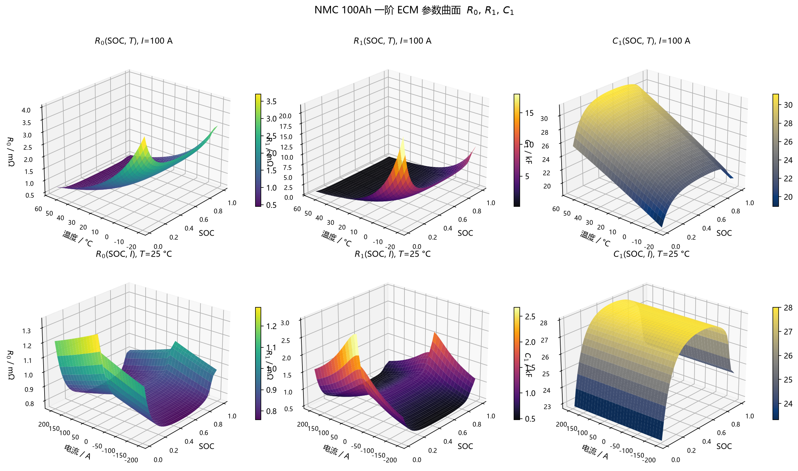

# 01-b 100 Ah NMC 电芯 ECM 参数规范
Powered by SpaceXAI Grok 4.6

> 配套代码：`Src/Sim/nmc100ah_ecm_params.py`、`Src/Sim/nmc100ah_ecm.py`、`Src/Sim/nmc100ah_ecm_demo.py`  
> 特性背景：`Doc/01-a-NCM电芯ECM参数R0_R1_C1特性.md`  
> 模型：默认一阶 Thevenin（OCV + \(R_0\) + \(R_1 \parallel C_1\)）；§11 给出可选 2RC 模板（仿真用）  
> 映射：\((I,\, T,\, \mathrm{SOC}) \rightarrow (R_0,\, R_1,\, C_1)\)；2RC 另出 \((R_2,\, C_2)\)

本文给出一套可标定、可替换的参数关系。默认数值是 **通用 100 Ah 方壳/软包 NMC 的模板**，用于搭模型、跑通工具链，**不是某一款商用电芯的出厂值**。换真实电芯时只改参数，不改结构。

---

## 1. 电芯假设与符号

| 项目 | 符号 / 值 | 说明 |
|------|-----------|------|
| 体系 | NMC（同 NCM） | 中高镍三元 + 石墨，模板按能量型方壳 |
| 额定容量 | \(Q_n = 100\,\mathrm{Ah}\) | \(1\,\mathrm{C} = 100\,\mathrm{A}\) |
| 电压窗口 | 2.80 / 3.67 / 4.20 V | 下限 / 标称 / 上限 |
| 寿命状态 | BOL | 不含 SOH 维，老化后应重标或整体缩放 |
| 电流符号 | 放电 \(I>0\)，充电 \(I<0\) | 与特性文档一致 |
| 温度 | \(T\) 用 °C 输入，Arrhenius 内部转开尔文 | 指电芯温度，不是环境温度 |
| SOC | \(s \in [0,1]\) | 代码也接受 0–100 百分数 |

端电压（本参数模型默认只出 \(R,C\)，时域仿真另走 `nmc100ah_gen.py`）：

\[
\begin{aligned}
\dot{U}_{p} &= -\frac{U_{p}}{R_{1}C_{1}} + \frac{I}{C_{1}} \\
U_{t} &= U_{\mathrm{ocv}}(s,T) - I R_{0} - U_{p}
\end{aligned}
\]

\[
\tau_{1} = R_{1} C_{1}
\]

可选 2RC（§11）再加 \(\dot U_{p2}=-U_{p2}/(R_2C_2)+I/C_2\)，\(U_t\) 减去 \(U_{p2}\)。默认代码与 BMS 仍按上式一阶走。

---

## 2. 关系结构

三个输出共用同一乘性结构，在参考点处每个因子都是 1：

\[
\begin{aligned}
R_{0}(s,T,I)
  &= R_{0,\mathrm{ref}} \cdot f_{s,0}(s)\cdot f_{\phi,0}(s)\cdot f_{T,0}(T)\cdot f_{I,0}(I)\cdot f_{\mathrm{dir},0}(s,I) \\
R_{1}(s,T,I)
  &= R_{1,\mathrm{ref}} \cdot f_{s,1}(s)\cdot f_{\phi,1}(s)\cdot f_{T,1}(T)\cdot f_{I,1}(I)\cdot f_{\mathrm{dir},1}(s,I) \\
C_{1}(s,T,I)
  &= C_{1,\mathrm{ref}} \cdot f_{s,C}(s)\cdot f_{\phi,C}(s)\cdot f_{T,C}(T)\cdot f_{I,C}(I)\cdot f_{\mathrm{dir},C}(s,I)
\end{aligned}
\]

| 因子 | 含义 | \(R_0\) | \(R_1\) | \(C_1\) |
|------|------|---------|---------|---------|
| \(f_s\) | SOC 大形态（U 形 / 反 U 形） | 浅 U | 深 U | 中段略高 |
| \(f_\phi\) | 高 SOC 相变局部凸起 | 弱 | 中 | 弱、反向 |
| \(f_T\) | Arrhenius 温度 | \(E_a\) 较小 | \(E_a\) 较大 | \(E_a<0\)（升温略增） |
| \(f_I\) | 电流 | 弱软化 | Butler–Volmer | 不修正 |
| \(f_{\mathrm{dir}}\) | 充放不对称 | 弱 | 强 | 无 |

参考点（BOL）：

\[
s_{\mathrm{ref}}=0.50,\quad T_{\mathrm{ref}}=25\,^\circ\mathrm{C},\quad I_{\mathrm{ref}}=+100\,\mathrm{A}\ (1\mathrm{C\ 放电})
\]

在该点：

\[
R_{0}=0.80\,\mathrm{m}\Omega,\quad
R_{1}=0.65\,\mathrm{m}\Omega,\quad
C_{1}=2.80\times 10^{4}\,\mathrm{F},\quad
\tau_{1}=18.2\,\mathrm{s}
\]

对应 10 s 直流内阻量级：

\[
R_{10\mathrm{s}} \approx R_{0}+R_{1}\bigl(1-e^{-10/\tau_{1}}\bigr) \approx 1.07\,\mathrm{m}\Omega
\]

与常见 100 Ah NMC 能量型电芯 10 s DCR（约 0.8–1.5 mΩ）同量级。

---

## 3. 各因子公式

### 3.1 SOC 大形态 \(f_s\)

先写未归一化形状，再除以参考点，保证 \(f_s(s_{\mathrm{ref}})=1\)：

\[
\begin{aligned}
g(s)
  &= 1 + a_{\mathrm{low}}\,e^{-s/s_{\mathrm{low}}}
       + a_{\mathrm{high}}\,e^{-(1-s)/s_{\mathrm{high}}}
       + p\,(s-0.5)^{2} \\
f_{s}(s) &= g(s)\,/\,g(s_{\mathrm{ref}})
\end{aligned}
\]

- \(a_{\mathrm{low}}>0\)：低 SOC 电阻上翘（\(C_1\) 取负，表示低 SOC 电容下降）
- \(a_{\mathrm{high}}>0\)：高 SOC 电阻上翘
- \(p\)：中段二次弯曲

### 3.2 高镍相变凸起 \(f_\phi\)

高镍 NMC 在约 4.15–4.25 V（模板取 \(s\approx 0.93\)）有 H2–H3 相变，电阻局部抬升：

\[
f_{\phi}(s) = 1 + A \exp\left[-\frac{1}{2}\left(\frac{s-s_{\phi}}{w_{\phi}}\right)^{2}\right]
\]

\(s_{\mathrm{ref}}=0.5\) 远离中心，\(f_{\phi}(s_{\mathrm{ref}})\approx 1\)，不必再归一化。

### 3.3 温度 \(f_T\)

\[
f_{T}(T)=\exp\left[\frac{E_{a}}{R}\left(\frac{1}{T+273.15}-\frac{1}{T_{\mathrm{ref}}+273.15}\right)\right]
\]

\(R=8.314462618\,\mathrm{J\,mol^{-1}\,K^{-1}}\)。\(E_a>0\) 时降温参数增大（电阻）；\(E_a<0\) 时降温参数减小（电容）。

### 3.4 电流 \(f_I\)

同样先算原始函数，再对 \(I_{\mathrm{ref}}\) 归一化，使 \(f_I(I_{\mathrm{ref}})=1\)。

**\(R_0\)：弱软化（自热 / 轻微非线性）**

\[
h_{0}(I)=\frac{1}{1+k_{0}\,|I|/I_{1\mathrm{C}}},\qquad
f_{I,0}(I)=\frac{h_{0}(I)}{h_{0}(I_{\mathrm{ref}})}
\]

**\(R_1\)：Butler–Volmer 表观电阻**

\[
h_{1}(I)=\frac{\mathrm{asinh}(|I|/I_{s})}{|I|/I_{s}}\ (I\neq 0),\qquad
h_{1}(0)=1
\]

\[
f_{I,1}(I)=\frac{h_{1}(I)}{h_{1}(I_{\mathrm{ref}})}
\]

\(|I|\ll I_s\) 时 \(h_1\to 1\)（相对 1C 参考点，小电流 \(R_1\) 更大）；大电流表观 \(R_1\) 下降。

**\(C_1\)：不修正**

\[
f_{I,C}(I)=1
\]

### 3.5 充放方向 \(f_{\mathrm{dir}}\)

放电（\(I\ge 0\)）在低 SOC 额外升高，充电（\(I<0\)）在高 SOC 额外升高。两个方向各自用 \(s_{\mathrm{ref}}\) 归一化，因此 **中段 SOC 充、放都回到参考值**，不对称只出现在两端。

\[
\begin{aligned}
d(s) &= 1 + d_{\mathrm{low}}\,e^{-s/s_{d}} \\
c(s) &= 1 + c_{\mathrm{high}}\,e^{-(1-s)/s_{c}} \\
f_{\mathrm{dir}}(s,I)
  &=
  \begin{cases}
    d(s)/d(s_{\mathrm{ref}}), & I \ge 0 \\
    c(s)/c(s_{\mathrm{ref}}), & I < 0
  \end{cases}
\end{aligned}
\]

\(I=0\)（静置）走放电支路。

---

## 4. 默认参数表

### 4.1 参考值与有效域

| 量 | 值 | 单位 |
|----|----|------|
| \(R_{0,\mathrm{ref}}\) | \(8.0\times 10^{-4}\) | \(\Omega\)（0.80 mΩ） |
| \(R_{1,\mathrm{ref}}\) | \(6.5\times 10^{-4}\) | \(\Omega\)（0.65 mΩ） |
| \(C_{1,\mathrm{ref}}\) | \(2.8\times 10^{4}\) | F |
| SOC | \([0.02,\,0.98]\) | 1 |
| \(T\) | \([-20,\,55]\) | °C |
| \(I\) | \([-300,\,300]\) | A（±3C） |

超界时代码默认裁剪并告警；`strict=True` 则抛错。

### 4.2 通道系数

| 系数 | \(R_0\) | \(R_1\) | \(C_1\) |
|------|---------|---------|---------|
| \(a_{\mathrm{low}}\) | 0.55 | 1.80 | −0.20 |
| \(s_{\mathrm{low}}\) | 0.08 | 0.07 | 0.10 |
| \(a_{\mathrm{high}}\) | 0.18 | 0.70 | −0.12 |
| \(s_{\mathrm{high}}\) | 0.07 | 0.06 | 0.08 |
| \(p\) | 0.20 | 0.35 | −0.10 |
| \(A\)（相变） | 0.08 | 0.15 | −0.05 |
| \(s_{\phi}\) | 0.93 | 0.93 | 0.93 |
| \(w_{\phi}\) | 0.03 | 0.03 | 0.03 |
| \(E_a\) / J·mol⁻¹ | 16 000 | 32 000 | −3 000 |
| 电流类型 | `linear_soft` | `bv_asinh` | `identity` |
| \(k_0\) | 0.06 | — | — |
| \(I_s\) / A | — | 50 | — |
| \(d_{\mathrm{low}}\) | 0.10 | 0.45 | 0 |
| \(s_{d}\) | 0.15 | 0.12 | 0.20 |
| \(c_{\mathrm{high}}\) | 0.08 | 0.55 | 0 |
| \(s_{c}\) | 0.12 | 0.10 | 0.20 |

### 4.3 温度倍率（由 \(E_a\) 算出，便于对照实验）

相对 25 °C：

| \(T\) | \(f_{T,R0}\) | \(f_{T,R1}\) | \(f_{T,C1}\) |
|-------|--------------|--------------|--------------|
| −20 °C | 3.150 | 9.921 | 0.806 |
| −10 °C | 2.360 | 5.567 | 0.851 |
| 0 °C | 1.805 | 3.259 | 0.895 |
| 15 °C | 1.251 | 1.565 | 0.959 |
| 25 °C | 1.000 | 1.000 | 1.000 |
| 40 °C | 0.734 | 0.539 | 1.060 |
| 55 °C | 0.554 | 0.307 | 1.117 |

### 4.4 电流倍率（相对 1C）

| \(I\) | \(f_{I,R0}\) | \(f_{I,R1}\) |
|-------|--------------|--------------|
| 0 A | 1.060 | 1.385 |
| 50 A | 1.029 | 1.221 |
| 100 A（参考） | 1.000 | 1.000 |
| 200 A | 0.946 | 0.725 |

小电流下 \(R_1\) 明显高于 1C HPPC 辨出的值，这是 Butler–Volmer 的预期行为。若你的表来自 1C 脉冲、又主要跑 1C，可保持现状；若主要跑小电流工况，应把 \(R_{1,\mathrm{ref}}\) 改成零电流线性电阻，或重标 \(I_s\)。

### 4.5 可选 2RC 参考值（仿真）

默认 1RC 三个 `ref_value` **不改**。2RC 作为可选慢支路叠在上面，供生成器制造「1RC 吃不干净」的电压；BMS / `ParamMLP` 仍只看见 \(R_0,R_1,C_1^\star\)。完整因子与手算见 §11。

| 量 | 值 | 单位 |
|----|----|------|
| \(R_{2,\mathrm{ref}}\) | \(2.8\times 10^{-4}\) | \(\Omega\)（0.28 mΩ） |
| \(C_{2,\mathrm{ref}}\) | \(3.2\times 10^{5}\) | F |
| \(\tau_{2,\mathrm{ref}}\) | \(89.6\) | s（约 90 s） |

参考点 1C 下慢极化幅度 \(I R_2=28\,\mathrm{mV}\)；对 10 s DCR 只加约 \(0.030\,\mathrm{m}\Omega\)（\(1.07\to 1.10\,\mathrm{m}\Omega\)），仍在 0.8–1.5 mΩ 带内。



---

## 5. 手算复核（参考点邻域）

**点 A**（参考点）  
\(s=0.5,\ T=25,\ I=+100\)  
\(R_0=0.800\,\mathrm{m}\Omega,\ R_1=0.650\,\mathrm{m}\Omega,\ C_1=28000\,\mathrm{F}\)

**点 B**（常温、低 SOC、1C 放电）  
\(s=0.10,\ T=25,\ I=+100\)  
默认模板：\(R_0=0.996\,\mathrm{m}\Omega,\ R_1=1.146\,\mathrm{m}\Omega,\ C_1=2.55\times 10^{4}\,\mathrm{F},\ \tau_1=29.3\,\mathrm{s}\)。

**点 C**（−10 °C、中 SOC、1C 放电）  
温度因子单独把 \(R_0\) 乘 2.36、\(R_1\) 乘 5.57，\(C_1\) 乘 0.85。低温功率由 \(R_1\) 主导。

**点 D**（常温、高 SOC、1C 充电）  
\(s=0.90,\ I=-100\)  
充电方向因子抬高 \(R_1\)，并叠加上 SOC 上翘与相变凸起的边缘。

---

## 6. 有效域与裁剪

| 输入 | 声明域 | 超出后 |
|------|--------|--------|
| SOC | 0.02–0.98 | 默认 clip；两端公式仍有定义，但不建议当真实 0%/100% |
| \(T\) | −20–55 °C | Arrhenius 外推误差指数放大，必须补测 |
| \(I\) | −3C–+3C | 更大电流的自热与浓度极化超出 1RC；2RC 也只是扩散的粗近似 |

模型 **默认不含**（§11 的 2RC 是可选生成器层，不进默认 `evaluate`）：

- SOH / 循环周次（计划中的仿真 \(q\) 因子另文落地，不改 BOL 默认）
- 滞后态（除充放分叉外）
- 芯表温差
- 第三 RC / Warburg / 分数阶
- OCV（电压仿真需另给 OCV–SOC 表）

---

## 7. Python 接口

依赖：`numpy`。

```text
Src/Sim/nmc100ah_ecm_params.py   参数数据类、默认值、JSON 读写
Src/Sim/nmc100ah_ecm.py          NMC100AhECM：evaluate / 查表 / 导出
Src/Sim/nmc100ah_ecm_demo.py     参考点复核、典型工况、可选导出
Src/Sim/nmc100ah_gen.py          充/放/静置时域仿真，输出 Data/*.csv
Src/Plot/plot_ecm_surfaces.py    R0/R1/C1 三维曲面
Src/Plot/plot_sim_waveforms.py   仿真波形
Src/Plot/plot_all.py             一次出曲面+波形
```

### 7.1 单点 / 批量

```python
import sys
sys.path.insert(0, "Src/Sim")
from nmc100ah_ecm import NMC100AhECM

model = NMC100AhECM()

# 标量，返回 (R0[ohm], R1[ohm], C1[F])
R0, R1, C1 = model.evaluate(i_a=100.0, t_celsius=25.0, soc=0.5)

# 百分数 SOC + C 率
R0, R1, C1 = model.evaluate(i_c=1.0, t_celsius=25.0, soc=50, soc_in_percent=True)

# 带因子分解，便于标定对照
out = model.evaluate_full(i_a=100.0, t_celsius=-10.0, soc=0.2)
print(out.R0_mohm, out.R1_mohm, out.C1, out.tau1)
print(out.f_r1)   # soc / phase / temperature / current / direction
```

`evaluate` 对 `numpy` 数组广播，可一次算整张工况面。

### 7.2 查找表

```python
table = model.build_map(
    soc=[0.1, 0.3, 0.5, 0.7, 0.9],
    t_celsius=[-10, 0, 25, 40],
    i_a=[-100, 100],
)
# table["R0"].shape == (5, 4, 2)

model.export_csv("Doc/NMC100Ah_ECM_lookup.csv",
                 soc=[0.05, 0.1, 0.2, 0.5, 0.8, 0.95],
                 t_celsius=[-20, -10, 0, 25, 40, 55],
                 i_a=[-200, -100, 100, 200])
```

### 7.3 替换参数

```python
from nmc100ah_ecm_params import ECMParamSet
from dataclasses import replace

p = ECMParamSet()
p.r0.to_json  # 整集写出：
p.to_json("my_cell.json")

# 改参考内阻（例如 HPPC 测得 0.72 mΩ）
p2 = replace(p, r0=replace(p.r0, ref_value=7.2e-4))
model = NMC100AhECM(p2)

# 或 JSON 往返
model = NMC100AhECM.from_json("my_cell.json")
```

`ParameterChannel` 与 `ECMParamSet` 是 `frozen` 数据类，改值用 `dataclasses.replace`。

### 7.4 命令行

在仓库根目录：

```powershell
python Src/Sim/nmc100ah_ecm_demo.py
python Src/Sim/nmc100ah_ecm_demo.py --json Doc/NMC100Ah_ECM_params.json --csv Doc/NMC100Ah_ECM_lookup.csv
python Src/Sim/nmc100ah_gen.py
python Src/Plot/plot_all.py
```

---

## 8. 用 HPPC 重标（推荐顺序）

不要一上来拟合全部二十多个系数。按下述拆开，每步只动少数几个数。

1. **参考点**  
   25 °C、SOC=50%、1C 放电脉冲：  
   \(R_{0,\mathrm{ref}}=\Delta U_{\mathrm{instant}}/I\)  
   \(R_{1,\mathrm{ref}}=(\Delta U_{\mathrm{end}}-\Delta U_{\mathrm{instant}})/I\)（扣掉脉冲期内 OCV 随 SOC 的下滑）  
   \(\tau_1\) 由搁置回弹指数拟合，\(C_{1,\mathrm{ref}}=\tau_1/R_{1,\mathrm{ref}}\)。

2. **SOC 形状**  
   固定 25 °C、1C，扫 SOC。先调 \(a_{\mathrm{low}},s_{\mathrm{low}}\) 对低端，再调 \(a_{\mathrm{high}},s_{\mathrm{high}}\) 对高端，最后用 \(p\) 修中段。高镍在 90%+ 仍对不齐时再动 \(A,s_\phi,w_\phi\)。

3. **温度**  
   固定 SOC=50%、1C，用 0 / 25 / 40 °C 三点估 \(E_a\)：

   \[
   E_a = R\cdot
   \frac{\ln\bigl(P(T_1)/P(T_2)\bigr)}{1/T_1-1/T_2}
   \]

   \(R_0\)、\(R_1\)、\(C_1\) 分开估。有 −10 °C 数据务必纳入，不要只靠常温外推。

4. **电流**  
   同一 SOC、温度，用 0.5C / 1C / 2C 脉冲调 \(k_0\) 或 \(I_s\)。  
   注意大电流脉冲的自热：辨识前先看芯温是否已经偏离设定值。

5. **充放**  
   同一 SOC 的充电脉冲与放电脉冲对比，调 \(d_{\mathrm{low}}\)（低 SOC 放电）和 \(c_{\mathrm{high}}\)（高 SOC 充电）。中段应对齐，对不齐先查 OCV 是否分了充放。

6. **冻结形状、只缩放参考值**  
   同体系不同容量时，可先按 \(R \propto 1/Q_n\)、\(C \propto Q_n\) 缩放三个 `ref_value`，再抽检两端 SOC 与低温。2RC 的 \(R_2,C_2\) 同样按此缩放。

7. **若要标 2RC**（只服务仿真 / 离线对照，不改 BMS 默认）  
   同一条 1C 脉冲，搁置 ≥ 5 min。回弹双指数约束 \(\tau_2\ge 4\tau_1\)：快支路对 \(R_1,C_1\)，慢支路对 \(R_2,C_2\)。若继续使用本节 1RC 的 \(R_{1,\mathrm{ref}}\) 而只**叠加**慢支路，就是 §11 的默认约定；若要用 2RC **替换** 1RC，应把原来的 \(R_1\) 拆小，使 \(R_1+R_2\) 接近旧的 1RC \(R_1\)（§11.4）。

NMC 的 OCV 有斜率，长脉冲必须从 \(\Delta U\) 中减去 \(\Delta U_{\mathrm{ocv}}\)，否则 \(R_1\)（以及 \(R_2\)）被系统性夸大。

---

## 9. 接入 BMS / 仿真的建议

| 用途 | 建议 |
|------|------|
| 在线 SOC 观测器 | 每步用当前 \(I,T,s\) 取 \(R_0,R_1,C_1\)，再离散化 **1RC** |
| SOP | \(R_{\mathrm{dyn}}(\Delta t)=R_0+R_1(1-e^{-\Delta t/\tau_1})\)；分钟级可再加 \(R_2\) 项 |
| 热功率 | \(I^{2}R_0 + I\cdot U_p\)（2RC 则 \(U_{p1}+U_{p2}\)） |
| Simulink | 跑 `export_csv` 做 3 维查表，或用 MATLAB 调本 Python |
| 换电芯 | 只换 JSON / `ref_value` 与 \(E_a\)，不要改乘性结构 |
| 错模型仿真 | 生成器开 §11 的 2RC；BMS 权重与 EKF 仍用 1RC |

离散时间（采样周期 \(\Delta t\)，放电电流为正）：

\[
\begin{aligned}
\alpha &= e^{-\Delta t/\tau_{1}} \\
U_{p,k} &= \alpha U_{p,k-1} + R_{1}(1-\alpha)\,I_{k} \\
U_{t,k} &= U_{\mathrm{ocv}}(s_k,T_k) - I_k R_{0} - U_{p,k}
\end{aligned}
\]

2RC 再并行一条 \(\alpha_2=\mathrm{e}^{-\Delta t/\tau_2}\)，\(U_{p2,k}=\alpha_2 U_{p2,k-1}+R_2(1-\alpha_2)I_k\)，端电压再减 \(U_{p2,k}\)。

---

## 10. 版本

| 项 | 内容 |
|----|------|
| 参数 schema | `1.0.0`（写入 JSON 的 `schema_version`）；2RC 通道落地后升 `1.1.0` |
| 默认电芯名 | `NMC-100Ah-Generic` |
| 与特性文档关系 | 本规范把特性文档中的定性规律落成可计算的默认函数；§11 对应 `Doc/01-a` §7 |

标定真实 100 Ah NMC 后，请改 `cell.name`，并在 JSON 里保留测试温度、脉冲倍率、静置时间和拟合残差，避免和本模板数值混用。

---

## 11. 100 Ah 电芯上的 2RC 参数估算

> 特性：`Doc/01-a` §7。本节只给**模板估算**，供仿真生成器选用。  
> **默认 `evaluate` / 网格 / BMS 仍是 1RC。** 代码未开 2RC 之前，这些数只作规范，不改变现有 JSON schema。

### 11.1 两种约定，不要混

| 约定 | \(R_0,R_1,C_1\) | \(R_2,C_2\) | 用途 |
|------|-----------------|-------------|------|
| **叠加**（默认） | 保持 §4 的 1RC 参考值 | 额外慢支路 | 生成器比 BMS 更真；1RC 表仍可对照 |
| **拆分** | 把原 1RC 的 \(R_1\) 拆成快+慢 | \(R_1+R_2\approx R_1^{\mathrm{1RC}}\) | 实验室 2RC 替换 1RC，总直流内阻差不多 |

叠加会把一部分扩散**算两次**（1RC 的 \(R_1\) 里已经吞了一点慢过程）。这是有意的：BMS 一阶去拟合这样的电压，就会留下 §11.5 和 `Doc/02-b` §10 要的慢残差。真电芯重标请用拆分，不要把叠加参考值写进控制器。

### 11.2 叠加约定：参考点

与 1RC 同一参考点（SOC = 50%，25 °C，1C 放电）：

\[
\begin{aligned}
R_{2,\mathrm{ref}} &= 0.28\,\mathrm{m}\Omega,\\
C_{2,\mathrm{ref}} &= 3.2\times 10^{5}\,\mathrm{F},\\
\tau_{2} &= R_{2}C_{2} = 89.6\,\mathrm{s}\ \approx 90\,\mathrm{s}
\end{aligned}
\]

选取理由（`Doc/01-a` §7.2）：

- \(\tau_{2}/\tau_{1}\approx 90/18.2\approx 4.9\)，双指数分得开
- 现有 SEQUENCE 的 120 s 静置能看见尾巴（约 \(1.3\tau_{2}\)），又不会和小时级 OCV 静置搅在一起
- \(R_{2}\approx 0.43\,R_{1}\)，慢极化可见，但不盖过欧姆跳变

参考点 1C：

| 量 | 1RC（§2） | 2RC 叠加后 |
|----|-----------|------------|
| \(R_{0}\) | 0.80 mΩ | 同左 |
| \(R_{1}\) / \(\tau_{1}\) | 0.65 mΩ / 18.2 s | 同左 |
| \(R_{2}\) / \(\tau_{2}\) | — | 0.28 mΩ / 89.6 s |
| \(I R_{2}\) | — | 28 mV |
| \(R_{10\mathrm{s}}\) | 1.07 mΩ | \(1.07+R_{2}(1-e^{-10/\tau_{2}})\approx 1.10\,\mathrm{m}\Omega\) |
| 长时 \(R_{\mathrm{dc}}\) | \(R_{0}+R_{1}=1.45\,\mathrm{m}\Omega\) | \(1.73\,\mathrm{m}\Omega\) |

10 s 几乎看不到慢支路；180 s 1C 末 \(U_{p2}\approx IR_{2}(1-e^{-180/89.6})\approx 24\,\mathrm{mV}\)；再静置 120 s 仍剩约 \(6\,\mathrm{mV}\)。这就是 1RC BMS 在默认工况上应留下的残差量级。

### 11.3 叠加约定：因子（比 \(R_{1}\) 简单）

\(R_{2},C_{2}\) 仍用 §2 的乘性结构，参考点各因子为 1。电流维默认恒等（扩散弱于 BV）；充放不对称弱于 \(R_{1}\)。

| 系数 | \(R_{2}\) | \(C_{2}\) |
|------|-----------|-----------|
| \(a_{\mathrm{low}}\) | 1.20 | −0.15 |
| \(s_{\mathrm{low}}\) | 0.08 | 0.10 |
| \(a_{\mathrm{high}}\) | 0.50 | −0.10 |
| \(s_{\mathrm{high}}\) | 0.07 | 0.08 |
| \(p\) | 0.25 | −0.08 |
| \(A\)（相变） | 0.08 | −0.03 |
| \(s_{\phi},w_{\phi}\) | 0.93, 0.03 | 同左 |
| \(E_{a}\) / J·mol⁻¹ | 28 000 | −4 000 |
| 电流类型 | `identity` | `identity` |
| \(d_{\mathrm{low}}\) | 0.20 | 0 |
| \(s_{d}\) | 0.15 | 0.20 |
| \(c_{\mathrm{high}}\) | 0.25 | 0 |
| \(s_{c}\) | 0.12 | 0.20 |

温度倍率（相对 25 °C，由 \(E_{a}\) 算出）：

| \(T\) | \(f_{T,R2}\) | \(f_{T,C2}\) |
|-------|--------------|--------------|
| −20 °C | 7.44 | 0.75 |
| −10 °C | 4.49 | 0.81 |
| 0 °C | 2.81 | 0.86 |
| 25 °C | 1.00 | 1.00 |
| 40 °C | 0.58 | 1.08 |
| 55 °C | 0.36 | 1.16 |

−10 °C、中 SOC、1C：\(R_{2}\approx 0.28\times 4.49\approx 1.26\,\mathrm{m}\Omega\)，\(I R_{2}\approx 126\,\mathrm{mV}\)，\(\tau_{2}\) 因 \(R_{2}\) 升、\(C_{2}\) 略降而拉到约 6–7 min。短脉冲走不到慢稳态，1RC 会把未走完的过程误判成偏长的 \(\tau_{1}\)。

有效域与 1RC 相同。\(\tau_{2}\) 建议裁到 \([20,\,600]\,\mathrm{s}\)，避免和 \(\tau_{1}\) 粘连或漂成「没静置够的 OCV」。

### 11.4 拆分约定（替换 1RC 时的起点）

若实验室已经按双指数标完、要用 2RC **代替** 原来的一只极化支路，不要叠加。一组与 §2 的 10 s DCR 接近的起点：

\[
\begin{aligned}
R_{0} &= 0.80\,\mathrm{m}\Omega\quad\text{（不动）}\\
R_{1} &= 0.42\,\mathrm{m}\Omega,\quad \tau_{1}=8\,\mathrm{s},\quad C_{1}\approx 1.90\times 10^{4}\,\mathrm{F}\\
R_{2} &= 0.28\,\mathrm{m}\Omega,\quad \tau_{2}=90\,\mathrm{s},\quad C_{2}\approx 3.21\times 10^{5}\,\mathrm{F}
\end{aligned}
\]

\[
R_{10\mathrm{s}}\approx 0.80+0.42\bigl(1-e^{-10/8}\bigr)+0.28\bigl(1-e^{-10/90}\bigr)\approx 1.13\,\mathrm{m}\Omega
\]

快支路更接近电荷转移，慢支路承担扩散。SOC / 温度因子可先沿用 §11.3 的 \(R_{2}\) 与 §4.2 的 \(R_{1}\)（把 \(R_{1}\) 的 \(E_{a}\) 略降到 28–30 kJ/mol 再微调）。**本仓库 BMS 不采用拆分当默认**；拆分只给「真要交 2RC 表」的人当初值。

容量缩放：\(R_{2}\propto 1/Q_{n}\)，\(C_{2}\propto Q_{n}\)，与 1RC 相同。50 Ah 约 \(R_{2}\approx 0.56\,\mathrm{m}\Omega\)、\(C_{2}\approx 1.6\times 10^{5}\,\mathrm{F}\)；280 Ah 约 \(R_{2}\approx 0.10\,\mathrm{m}\Omega\)、\(C_{2}\approx 9\times 10^{5}\,\mathrm{F}\)。

### 11.5 手算：1RC 观测器会看见什么

叠加约定、参考点、1C 放电 180 s 再静置 120 s（接近默认 SEQUENCE）：

| 时刻 | \(U_{p2}\) | 1RC 无法用 \(\tau_{1}=18\,\mathrm{s}\) 解释的部分 |
|------|------------|--------------------------------------------------|
| 脉冲 10 s | ≈ 3.0 mV | 边沿仍是 \(IR_{0}\)；10 s SOP 几乎无感 |
| 脉冲 180 s 末 | ≈ 24 mV | 1RC 会用偏大的 \(R_{1}\) 去吃大部分幅度 |
| 静置 30 s | ≈ 17 mV | 快支路已消大半，慢尾巴开始显 |
| 静置 120 s | ≈ 6 mV | 单指数残差同号；门控若只看 30 s 静置会低估 |
| 再静置到 5 min | ≈ 1 mV | 接近测量噪声（模板 0.5 mV） |

1C 下 6–24 mV 的慢分量，若被 EKF 整段啃进 SOC：中段 \(\partial U_{\mathrm{ocv}}/\partial s\sim 0.4\,\mathrm{V}\) 时约 1.5–6 个百分点的短暂偏差，回弹结束后应退回。定量误差预算见 `Doc/02-b` §10。

### 11.6 不要把这些数写进 BMS 默认表

- 未用目标电芯双指数重标之前，§11.2 只是生成器开关
- 打开 2RC 仿真时 JSON 写明 `rc_order=2` 与 `soh`（若有），schema 升 `1.1.0`，避免和 BOL 1RC 模板混用
- \(C_{2}\) 比 \(C_{1}\) 更不可观；生成器里建议钉死 \(C_{2,\mathrm{ref}}\)，只让 \(R_{2}(s,T)\) 变（与方案 B 同一逻辑）
